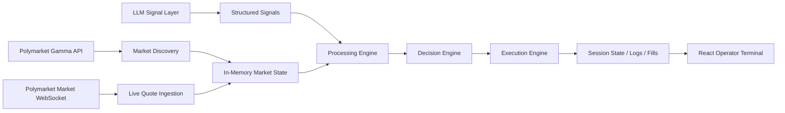
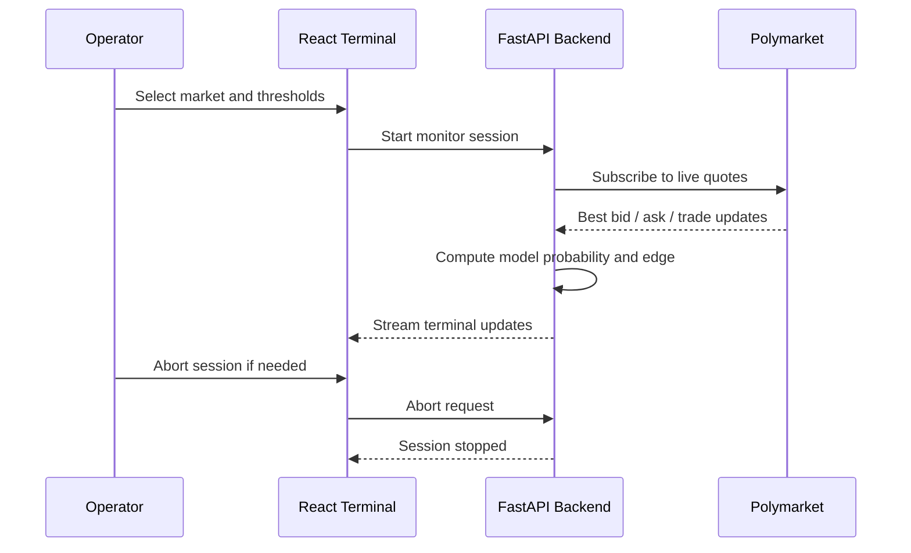

# Probis
Probis is a low-latency, AI-assisted trading system for real-time prediction markets. It combines live market data, probabilistic modeling, and LLM-based signal extraction to identify mispriced events and execute trades automatically.


The project is designed around a simple principle: keep the hot path small. Market data comes in, state updates in memory, the model computes edge, and the execution layer decides whether to act. LLM usage is isolated to slower signal-enrichment workflows and is not part of the execution brain.

## Start

```bash
./dev.sh
```

That single command starts the backend and frontend together, prepares missing local dependencies when needed, and shuts both services down cleanly when you stop the process.

## System Design



## Operator Flow



## Architecture

### Frontend

The frontend is a React operator terminal focused on clarity under live conditions. It presents the active Polymarket board, session controls, live quote context, and operator tape in a single workflow.

Key responsibilities:

- Display live market catalog and quote context.
- Let the operator choose a market and configure thresholds.
- Start and abort monitoring sessions.
- Stream fills, logs, session state, and model-vs-market edge.

### Backend

The backend is a FastAPI service with asyncio workers and an in-memory state core.

Key responsibilities:

- Discover active Polymarket markets.
- Subscribe to the public Polymarket market websocket.
- Maintain live market state in memory.
- Run deterministic processing and decision logic.
- Manage monitor sessions and stream terminal updates.
- Simulate execution while preserving the shape of a real execution pipeline.

### Data Sources

Current live inputs:

- Polymarket Gamma API for market discovery.
- Polymarket public market websocket for best bid, best ask, and trade-driven price updates.

Current optional input:

- Ollama/Gemma signal extraction layer, kept off the critical path.

## Codebase Structure

- `dev.sh` : one-command local launcher for the full stack.
- `backend/src/probis/main.py` : backend startup and worker orchestration.
- `backend/src/probis/api.py` : REST and websocket API surface for the terminal.
- `backend/src/probis/controller.py` : live market catalog management and session lifecycle.
- `backend/src/probis/services/polymarket.py` : Polymarket discovery and websocket ingestion.
- `backend/src/probis/workers.py` : processing, decision, execution, and signal workers.
- `backend/src/probis/state.py` : shared in-memory state used across the backend runtime.
- `frontend/src/App.tsx` : primary operator terminal UI.
- `frontend/src/lib/api.ts` : frontend API and websocket client bindings.
- `frontend/src/lib/types.ts` : shared frontend data contracts.

## Runtime Model

### Live Today

- Market discovery is live.
- Quote display is live.
- Session control is live.
- Edge computation is deterministic.
- Terminal updates stream in real time.

### Still Simulated

- Trade execution and fills are still simulated locally.
- Account connectivity and signed Polymarket order flow are not yet enabled.

## Design Principles

- Event-driven over polling.
- Deterministic logic over LLM decision-making.
- In-memory state over repeated storage reads.
- Clear operator control over opaque automation.
- Small hot path over broad system complexity.

## Stack

- Backend: Python, FastAPI, asyncio, NumPy
- Frontend: React, TypeScript, Vite
- Live Market Data: Polymarket Gamma API and market websocket
- Local Infra: Redis and PostgreSQL ready for expansion
- Signal Layer: Ollama / Gemma, isolated from the execution path

## Notes

- Redis is optional for local startup; the backend falls back to an in-process bus if Redis is unavailable.
- The terminal is intended to be the single operator surface for monitoring, intervention, and later real account control.
- This repository is structured so real account execution can be added without changing the frontend workflow.
