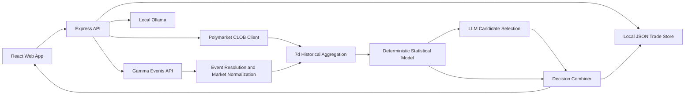
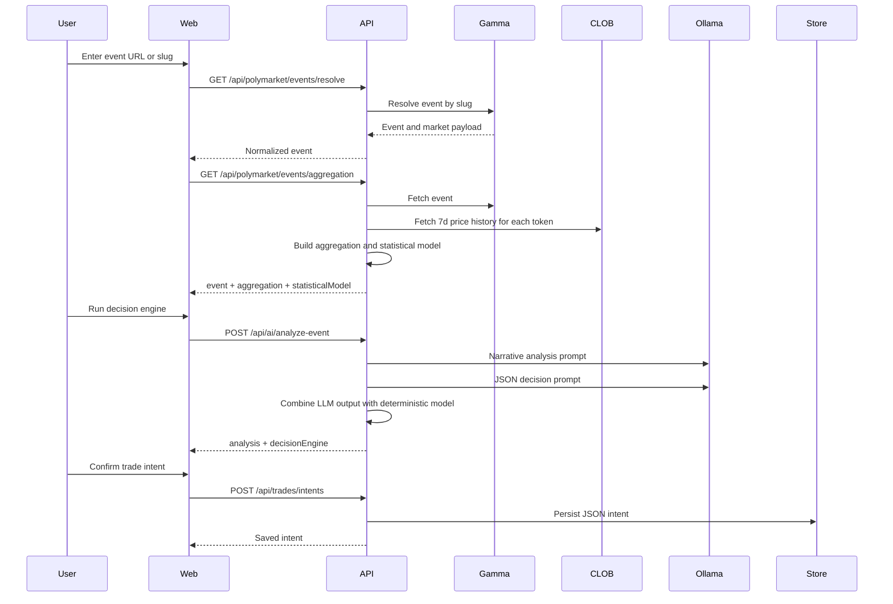
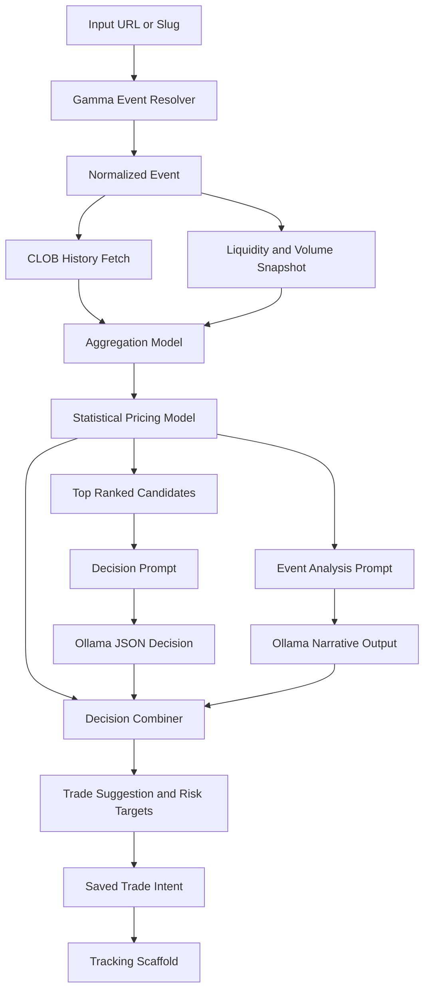

# Probis

Probis is a local-first Polymarket analysis and trade-planning system. The current codebase is built around a deterministic market-scoring pipeline, a constrained LLM recommendation layer, and a lightweight operator UI for reviewing opportunities, sizing trades, and storing execution intents.

The hot path in this repo is not autonomous execution. It is event resolution, market normalization, historical aggregation, statistical scoring, recommendation synthesis, and manual trade preparation.

## Quick Start

For a first run, you only need Node.js, Ollama, and the default local API URL.

1. Install dependencies.

```bash
npm install
```

2. Copy `.env.example` to `.env` and keep the defaults unless you need custom endpoints.

```bash
cp .env.example .env
```

3. Start Ollama and make sure at least one model is available.

```bash
ollama serve
ollama list
```

4. Start the API and web app.

```bash
npm run dev
```

5. Verify the backend.

```bash
curl http://localhost:4000/health
```

6. Open the web app, resolve a Polymarket event, and run the decision engine.

- Web UI: `http://localhost:5173`
- API: `http://localhost:4000`
- If you want full Polymarket auth checks, add `POLYMARKET_API_KEY` and `POLYMARKET_PRIVATE_KEY` to `.env`.

### Polymarket US Live Trading Credentials

To place live buy/sell orders through `/api/trades/intents/:id/execute` and `/api/trades/intents/:id/sell`, configure these environment variables:

- `POLYMARKET_US_KEY_ID` (or fallback `POLYMARKET_API_KEY`)
- `POLYMARKET_US_SECRET_KEY` (or fallback `POLYMARKET_PRIVATE_KEY`)
- `POLYMARKET_US_BASE_URL` (default `https://api.polymarket.us`)

The API signs requests using Ed25519 with the format described in Polymarket US docs: `timestamp + method + path`.

## What The Current Codebase Does

- Resolves a Polymarket event from either a full URL or a slug.
- Falls back to fuzzy active-event matching if the exact slug lookup misses.
- Pulls live event and market state from Gamma.
- Pulls 7-day outcome price history from the Polymarket CLOB client.
- Builds deterministic per-market and per-outcome scores from price, momentum, volatility, liquidity share, and volume share.
- Uses Ollama locally for two tasks: narrative event analysis and JSON recommendation selection.
- Combines deterministic model output with LLM output into a single decision payload.
- Lets the user preview stake, expected value, break-even, stop-loss, take-profit, and risk/reward.
- Persists trade intents to a local JSON store.
- Converts a saved intent into a tracking scaffold and execution-request shape.
- Polls tracked positions against current market probability and evaluates stop-loss and take-profit triggers.
- Exposes operator controls for Sell Now and Stop Bot on tracked positions.

## Workspace Layout

```text
.
├── apps/
│   ├── api/
│   │   ├── package.json
│   │   └── src/
│   │       ├── config/
│   │       │   └── env.js
│   │       ├── lib/
│   │       │   └── logger.js
│   │       ├── routes/
│   │       │   ├── ai.js
│   │       │   ├── health.js
│   │       │   ├── polymarket.js
│   │       │   └── trades.js
│   │       └── services/
│   │           ├── decision-engine.js
│   │           ├── ollama.js
│   │           ├── trade-intents.js
│   │           └── polymarket/
│   │               ├── aggregation.js
│   │               ├── client.js
│   │               ├── event-data.js
│   │               ├── gamma.js
│   │               └── statistical-model.js
│   └── web/
│       ├── package.json
│       └── src/
│           ├── App.jsx
│           ├── lib/
│           │   └── api.js
│           └── styles.css
├── data/
│   └── trade-intents.json
├── .env.example
├── package.json
└── plan.md
```

## Runtime Architecture



## System Design

### 1. API Layer

The API is a single Express service in `apps/api`. It exposes four route groups:

- `GET /health`
	Returns service timestamp plus live Polymarket and Ollama status.
- `GET /api/polymarket/*`
	Handles event discovery, direct event resolution, analytics resolution, and cache invalidation.
- `GET|POST /api/ai/*`
	Handles Ollama availability, prompt smoke tests, and full event analysis plus decision output.
- `GET|POST|PATCH|DELETE /api/trades/*`
	Handles local trade-intent storage, execution-request shaping, live monitoring updates, and tracked-position actions.

### 2. Data Providers

There are two external data sources and one local persistence layer:

- Gamma API
	Used for active event discovery and detailed event lookup by slug.
- Polymarket CLOB client
	Used for price-history retrieval and auth/readiness checks.
- Local JSON store
	Used for saved trade intents in `data/trade-intents.json`.

### 3. Frontend Operator Console

The React app in `apps/web` is an analyst and trader console, not a passive dashboard. The flow is:

1. Load system status and top active events.
2. Resolve an event from URL or slug.
3. View live markets plus historical and model overlays.
4. Run the decision engine.
5. Adjust sizing and risk controls.
6. Save or edit the trade intent.
7. Transition the intent into tracking.
8. Poll or manage active tracked positions from the operator console.

## End-to-End Flow



## Decision Engine Architecture

The engine is split into distinct models and stages. Each one has a separate responsibility.

### Model 1: Event Resolution Model

Implemented in `apps/api/src/services/polymarket/gamma.js`.

Purpose:

- Convert a URL or slug into a valid Polymarket event.
- Normalize Gamma payloads into a stable internal shape.
- Recover from slug mismatches by scoring active-event candidates.

Behavior:

- Extracts the slug from URLs like `/event/...` or `/events/...`.
- Tries a direct `events/slug/:slug` lookup first.
- If that lookup fails with `404`, fetches active events and scores fuzzy matches.
- Normalizes event, market, and outcome fields into numeric-safe internal objects.

This is effectively the input-normalization model for the rest of the engine.

### Model 2: Aggregation Model

Implemented in `apps/api/src/services/polymarket/aggregation.js`.

Purpose:

- Build a clean event analytics view from live market state plus short-horizon history.

Inputs:

- Event liquidity and volume.
- Market liquidity and volume.
- Outcome token IDs.
- 7-day CLOB price history with daily fidelity.

Outputs:

- `liquiditySnapshot`
- `derivedMetrics`
- `historicalPrices`

Derived metrics include:

- Top outcome by current probability.
- Highest-volume market.
- Highest-liquidity market.
- Most competitive market, defined by the smallest probability gap between top two outcomes.
- Average liquidity and volume per live market.

This stage does not make trading recommendations. It prepares the feature space used by the statistical model.

### Model 3: Statistical Pricing Model

Implemented in `apps/api/src/services/polymarket/statistical-model.js`.

Purpose:

- Produce a deterministic estimate of each outcome's fair probability.
- Quantify edge and confidence from observable market behavior.

Methodology in code:

- Start with current market probability.
- Add a momentum term from 7-day absolute price change.
- Add a historical-anchor term from the average of first, latest, high, and low price observations.
- Apply a volatility penalty when the price range is wide.
- Weight adjustments by market quality and sample strength.

Core features:

- `currentProbability`
- `momentum`
- `volatility`
- `quality`
	Average of liquidity share and volume share.
- `sampleStrength`
	A capped function of available history points.
- `historicalAnchor`

For each outcome, the model returns:

- `estimatedProbability`
- `edge = estimatedProbability - currentProbability`
- `confidence`
- feature diagnostics

For each market, the model returns:

- average market confidence
- the best positive-edge outcome as `opportunity`

For the event, the model returns:

- `bestOpportunity`
- `highestConfidenceMarket`

Conceptually, the deterministic estimate is:

$$
rawEstimate
= p_{current}
+ (\text{momentum} \times w_{trend})
+ ((\text{anchor} - p_{current}) \times w_{anchor})
$$

followed by a volatility-based shrinkage toward $0.5$, and then normalization across outcomes in the same market.

### Model 4: LLM Analysis Model

Implemented in `apps/api/src/services/ollama.js` via `buildEventAnalysisPrompt` and `runAiTest`.

Purpose:

- Produce a concise human-readable readout of event state, strongest opportunity, divergence reason, and key risk.

This model is explanatory, not authoritative. It does not directly choose the final action.

### Model 5: LLM Candidate Selection Model

Implemented in `apps/api/src/services/ollama.js` via `buildDecisionEnginePrompt` and `runAiJson`.

Purpose:

- Choose one recommendation from the top deterministic candidates.
- Return structured JSON only.

Important constraint:

- The LLM is not allowed to invent a market or outcome.
- It is limited to the top three deterministic candidates with the exact provided `marketQuestion` and `outcomeLabel` values.

Expected JSON schema:

```json
{
	"marketQuestion": "string",
	"outcomeLabel": "string",
	"confidence": 0.0,
	"agreeWithModel": true,
	"thesis": "string",
	"keyRisk": "string",
	"reasons": ["string", "string", "string"]
}
```

### Model 6: Final Recommendation Combiner

Implemented in `apps/api/src/services/decision-engine.js`.

Purpose:

- Merge deterministic ranking with LLM selection.
- Convert probabilities into an action, stake suggestion, EV estimate, and risk targets.

How it works:

- Validate the LLM selection against actual model outputs.
- Fall back to the model's best opportunity if the LLM output is missing or inconsistent.
- Compute combined confidence as the average of model confidence and LLM confidence.
- Compute `expectedValuePerDollar` as:

$$
EV = \frac{p_{model}}{p_{market}} - 1
$$

- Generate an action:
	- `buy` if edge is positive enough, confidence is high enough, and the LLM agrees.
	- `avoid` if edge is negative enough or the LLM has low confidence and disagrees.
	- otherwise `watch`.
- Suggest a bankroll fraction for buys, capped between 1% and 20%.
- Generate default stop-loss and take-profit probabilities from current probability and edge magnitude.

Outputs include:

- `action`
- `recommendation.marketQuestion`
- `recommendation.outcomeLabel`
- `currentProbability`
- `modelProbability`
- `edge`
- `expectedValuePerDollar`
- `combinedConfidence`
- `suggestedStakeFraction`
- `stopLossProbability`
- `takeProfitProbability`
- `riskRewardRatio`
- `thesis`, `keyRisk`, and `reasons`

## Engine Dataflow



## Caching Design

Implemented in `apps/api/src/services/polymarket/event-data.js`.

Behavior:

- Analytics are cached in memory by normalized event slug.
- Each cache entry has a TTL controlled by `ANALYTICS_CACHE_TTL_MS`.
- `refresh=true` bypasses cache for a single request.
- `POST /api/polymarket/events/aggregation/invalidate` clears one event or all events.

This cache covers the expensive analytics path: event fetch, history aggregation, and statistical-model construction.

## Trade Intent Lifecycle

Implemented in `apps/api/src/services/trade-intents.js`.

The backend does not place live orders yet. Instead, it manages an intent lifecycle:

1. Build a validated intent payload.
2. Persist it to local JSON.
3. Rebuild an execution-request shape from edited values.
4. Move the intent to `tracking` when execution is requested.
5. Attach a monitoring scaffold with stop-loss and take-profit thresholds.

Execution-request payloads currently include:

- venue and side metadata
- trade amount
- entry probability
- estimated shares
- stop-loss and take-profit probabilities
- manual-execution constraints

This is trade planning and monitoring preparation, not automated execution.

## Frontend UX Architecture

Implemented primarily in `apps/web/src/App.jsx`.

The UI is organized around one analyst workflow:

1. Inspect backend connectivity and current Ollama model.
2. Pick a high-volume event or paste a direct event URL.
3. Review market board, sparkline history, and event metrics.
4. Rank markets by model edge, confidence, liquidity, or momentum.
5. Run the decision engine.
6. Preview the recommended trade with sizing and editable risk inputs.
7. Save, restore, edit, delete, or start tracking a trade intent.

The frontend keeps a local draft in browser storage so an in-progress recommendation survives refresh.

## Configuration

Environment variables currently used by the codebase:

```bash
POLYMARKET_API_KEY=
POLYMARKET_PRIVATE_KEY=
PORT=4000
VITE_API_BASE_URL=http://localhost:4000
OLLAMA_BASE_URL=http://localhost:11434
OLLAMA_MODEL=gemma3:latest
ANALYTICS_CACHE_TTL_MS=300000
```

Notes:

- `POLYMARKET_PRIVATE_KEY` is used to validate signer compatibility and derive CLOB API credentials.
- Gamma event reads still work even when trading credentials are not ready.
- Ollama must be running locally and have at least one available model.

## Development

Requirements:

- Node.js 20+
- A local Ollama instance for AI routes
- Polymarket credentials if you want full auth/readiness checks

Install and run:

```bash
npm install
npm run dev
```

Useful commands:

```bash
npm run dev:api
npm run dev:web
npm run build
npm run start
curl http://localhost:4000/health
```

## API Surface

### Health and status

- `GET /`
- `GET /health`
- `GET /api/polymarket/status`
- `GET /api/ai/status`

### Event discovery and analytics

- `GET /api/polymarket/events?limit=10&offset=0`
- `GET /api/polymarket/events/resolve?input=<url-or-slug>`
- `GET /api/polymarket/events/aggregation?input=<url-or-slug>`
- `GET /api/polymarket/events/aggregation?input=<url-or-slug>&refresh=true`
- `POST /api/polymarket/events/aggregation/invalidate`

### AI and decision support

- `POST /api/ai/test`
- `POST /api/ai/analyze-event`

### Trade intent storage

- `GET /api/trades/intents?limit=6`
- `POST /api/trades/intents`
- `PATCH /api/trades/intents/:id`
- `DELETE /api/trades/intents/:id`
- `POST /api/trades/intents/:id/execute`

## API Examples

These examples are trimmed to the fields most useful for integration and debugging. Actual payloads include additional fields.

### 1. Health check

Request:

```bash
curl http://localhost:4000/health
```

Response:

```json
{
	"ok": true,
	"service": "probis-api",
	"timestamp": "2026-04-15T18:42:10.000Z",
	"polymarket": {
		"configured": false,
		"host": "https://clob.polymarket.com",
		"chainId": 137,
		"publicReadOk": true,
		"auth": {
			"privateKeyValid": false,
			"signerAddress": null,
			"derivedApiCredsReady": false,
			"derivedApiKeyMatchesEnv": null,
			"error": null
		}
	},
	"ollama": {
		"reachable": true,
		"requestedModel": "gemma3:latest",
		"resolvedModel": "gemma3:latest",
		"availableModels": ["gemma3:latest"]
	}
}
```

### 2. Resolve an event

Request:

```bash
curl "http://localhost:4000/api/polymarket/events/resolve?input=https://polymarket.com/event/will-the-fed-cut-rates-in-june"
```

Response:

```json
{
	"ok": true,
	"event": {
		"id": "12345",
		"slug": "will-the-fed-cut-rates-in-june",
		"title": "Will the Fed cut rates in June?",
		"description": "...",
		"active": true,
		"closed": false,
		"endDate": "2026-06-18T00:00:00Z",
		"startDate": "2026-01-10T00:00:00Z",
		"liquidity": 184522.12,
		"volume": 912004.55,
		"markets": [
			{
				"id": "mkt_1",
				"question": "Will the Fed cut rates in June?",
				"conditionId": "0xabc123",
				"liquidity": 184522.12,
				"volume": 912004.55,
				"outcomes": [
					{
						"label": "Yes",
						"price": 0.42,
						"probability": 0.42,
						"tokenId": "1001"
					},
					{
						"label": "No",
						"price": 0.58,
						"probability": 0.58,
						"tokenId": "1002"
					}
				]
			}
		]
	}
}
```

### 3. Resolve event analytics

Request:

```bash
curl "http://localhost:4000/api/polymarket/events/aggregation?input=will-the-fed-cut-rates-in-june"
```

Response:

```json
{
	"ok": true,
	"event": {
		"id": "12345",
		"slug": "will-the-fed-cut-rates-in-june",
		"title": "Will the Fed cut rates in June?",
		"resolvedFromFallback": false,
		"requestedSlug": null
	},
	"aggregation": {
		"generatedAt": "2026-04-15T18:45:00.000Z",
		"historyWindow": {
			"intervalLabel": "7d",
			"fidelityMinutes": 1440
		},
		"liquiditySnapshot": {
			"eventLiquidity": 184522.12,
			"eventVolume": 912004.55,
			"liveMarketCount": 1,
			"pricedOutcomeCount": 2
		},
		"derivedMetrics": {
			"topOutcome": {
				"question": "Will the Fed cut rates in June?",
				"label": "No",
				"probability": 0.58
			},
			"highestVolumeMarket": {
				"question": "Will the Fed cut rates in June?",
				"value": 912004.55
			},
			"mostCompetitiveMarket": {
				"question": "Will the Fed cut rates in June?",
				"probabilityGap": 0.16,
				"leadingOutcome": "No"
			}
		},
		"historicalPrices": {
			"markets": [
				{
					"question": "Will the Fed cut rates in June?",
					"outcomes": [
						{
							"label": "Yes",
							"currentProbability": 0.42,
							"historySummary": {
								"pointCount": 7,
								"firstPrice": 0.37,
								"latestPrice": 0.42,
								"percentChange": 0.1351
							}
						}
					]
				}
			]
		}
	},
	"statisticalModel": {
		"generatedAt": "2026-04-15T18:45:00.000Z",
		"methodology": {
			"name": "first-pass-statistical-model"
		},
		"summary": {
			"eventSlug": "will-the-fed-cut-rates-in-june",
			"liveMarketCount": 1,
			"bestOpportunity": {
				"question": "Will the Fed cut rates in June?",
				"label": "Yes",
				"currentProbability": 0.42,
				"estimatedProbability": 0.47,
				"edge": 0.05,
				"confidence": 0.64,
				"score": 0.032
			}
		}
	}
}
```

### 4. Run the AI analysis and decision engine

Request:

```bash
curl -X POST http://localhost:4000/api/ai/analyze-event \
	-H "Content-Type: application/json" \
	-d '{"input":"will-the-fed-cut-rates-in-june"}'
```

Response:

```json
{
	"ok": true,
	"event": {
		"slug": "will-the-fed-cut-rates-in-june",
		"title": "Will the Fed cut rates in June?"
	},
	"aggregation": {
		"derivedMetrics": {
			"topOutcome": {
				"label": "No",
				"probability": 0.58
			}
		}
	},
	"statisticalModel": {
		"summary": {
			"bestOpportunity": {
				"question": "Will the Fed cut rates in June?",
				"label": "Yes",
				"edge": 0.05,
				"confidence": 0.64
			}
		}
	},
	"analysis": "- Event state: ...\n- Strongest market/opportunity: ...\n- Why the model differs: ...\n- Key risk: ...",
	"decisionEngine": {
		"generatedAt": "2026-04-15T18:47:00.000Z",
		"action": "buy",
		"recommendation": {
			"marketQuestion": "Will the Fed cut rates in June?",
			"outcomeLabel": "Yes",
			"currentProbability": 0.42,
			"modelProbability": 0.47,
			"edge": 0.05,
			"expectedValuePerDollar": 0.119,
			"combinedConfidence": 0.67,
			"modelConfidence": 0.64,
			"llmConfidence": 0.7,
			"agreementWithModel": true,
			"suggestedStakeFraction": 0.134,
			"stopLossProbability": 0.39,
			"takeProfitProbability": 0.48,
			"riskRewardRatio": 2.0,
			"thesis": "The recent upward move in Yes has not fully caught up with the model estimate.",
			"keyRisk": "Macro headlines could reverse sentiment quickly.",
			"reasons": [
				"Positive 7d momentum",
				"Model fair value above market price",
				"Adequate liquidity for a manual entry"
			]
		}
	},
	"model": "gemma3:latest",
	"requestedModel": "gemma3:latest"
}
```

### 5. Save a trade intent

Request:

```bash
curl -X POST http://localhost:4000/api/trades/intents \
	-H "Content-Type: application/json" \
	-d '{
		"eventSlug": "will-the-fed-cut-rates-in-june",
		"eventTitle": "Will the Fed cut rates in June?",
		"conditionId": "0xabc123",
		"marketQuestion": "Will the Fed cut rates in June?",
		"outcomeLabel": "Yes",
		"action": "buy",
		"tradeAmount": 100,
		"recommendation": {
			"currentProbability": 0.42,
			"modelProbability": 0.47,
			"edge": 0.05
		},
		"tradeSuggestion": {
			"amount": 100,
			"stopLossProbability": 0.39,
			"takeProfitProbability": 0.48
		}
	}'
```

Response:

```json
{
	"ok": true,
	"intent": {
		"id": "9f4cf9c3-faf9-4f8f-84fa-0fa5244f0fd4",
		"status": "confirmed",
		"createdAt": "2026-04-15T18:49:00.000Z",
		"confirmedAt": "2026-04-15T18:49:00.000Z",
		"eventSlug": "will-the-fed-cut-rates-in-june",
		"marketQuestion": "Will the Fed cut rates in June?",
		"outcomeLabel": "Yes",
		"tradeAmount": 100,
		"tradeSuggestion": {
			"amount": 100,
			"stopLossProbability": 0.39,
			"takeProfitProbability": 0.48
		},
		"executionRequest": {
			"requestType": "market-buy-intent",
			"venue": "polymarket-us",
			"side": "buy",
			"orderType": "market-intent",
			"readyForExecution": false,
			"entryProbability": 0.42,
			"sharesEstimate": 238.09523809523807
		}
	}
}
```

### 6. Start tracking a saved trade intent

Request:

```bash
curl -X POST http://localhost:4000/api/trades/intents/9f4cf9c3-faf9-4f8f-84fa-0fa5244f0fd4/execute
```

Response:

```json
{
	"ok": true,
	"intent": {
		"id": "9f4cf9c3-faf9-4f8f-84fa-0fa5244f0fd4",
		"status": "tracking",
		"executionRequest": {
			"readyForExecution": true,
			"preparedAt": "2026-04-15T18:50:00.000Z"
		},
		"monitoring": {
			"state": "active",
			"activatedAt": "2026-04-15T18:50:00.000Z",
			"currentProbability": 0.42,
			"entryProbability": 0.42,
			"stopLossProbability": 0.39,
			"takeProfitProbability": 0.48,
			"notes": "Monitoring scaffold only. Live polling and exit automation are not wired yet."
		}
	}
}
```

## Current Boundaries

What this repo does today:

- event discovery
- event normalization
- market history aggregation
- deterministic opportunity scoring
- local LLM-assisted explanation and recommendation
- risk-target generation
- trade intent persistence
- monitoring-state scaffolding

What this repo does not do yet:

- live automated order placement
- live position polling
- live exit automation
- portfolio accounting
- backtesting and model-evaluation infrastructure
- multi-venue routing

## Practical Summary

The current system design is a layered decision-support stack:

1. Resolve and normalize market data.
2. Aggregate short-horizon market history.
3. Score each outcome with deterministic logic.
4. Let the LLM explain and select only within constrained candidates.
5. Combine both views into an operator-facing recommendation.
6. Store the result as a trade intent for manual execution and later monitoring.

That makes the codebase suitable for research, triage, and trade planning, while keeping the core recommendation path anchored in observable market features rather than unconstrained model output.