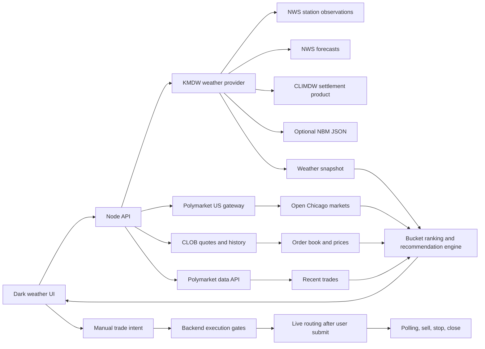
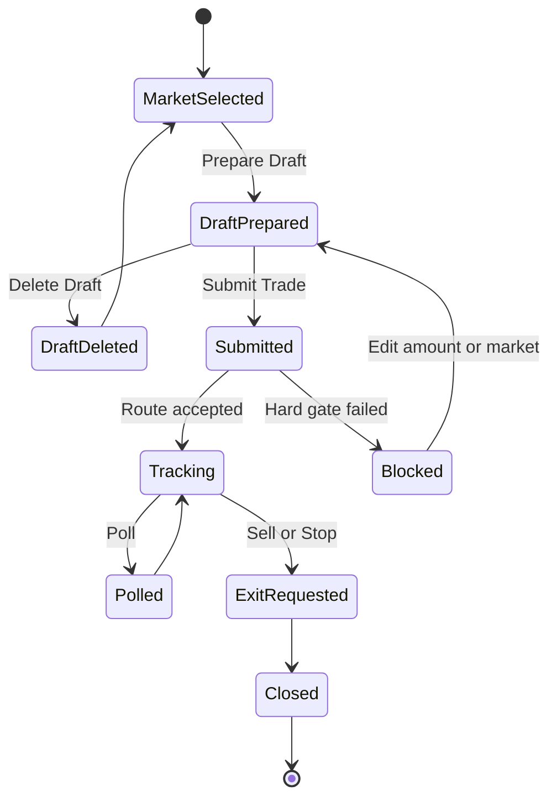
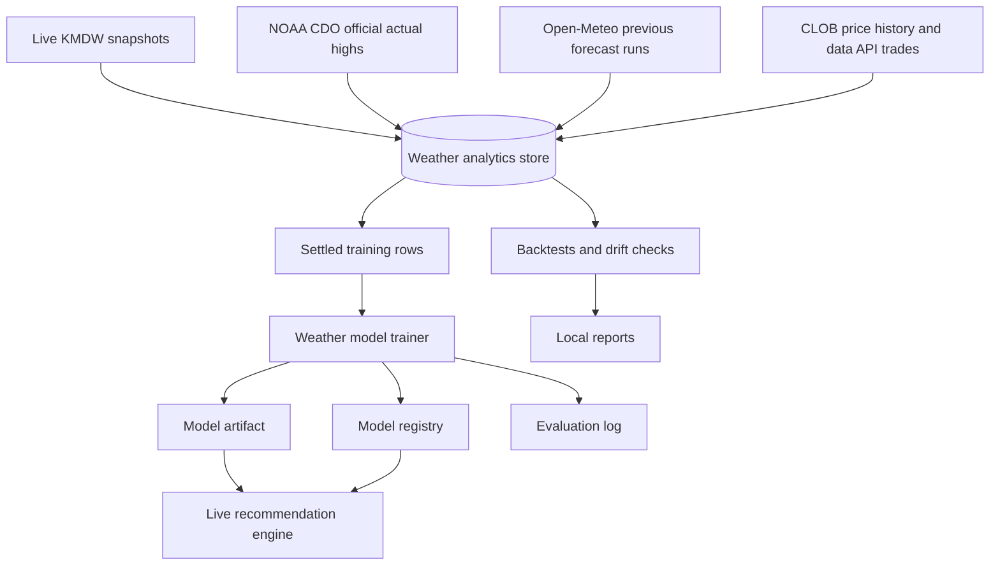

# Probis

Probis is a local-first weather trading workstation for Polymarket US. The current product scope is intentionally narrow: Chicago Midway Airport (`KMDW`) daily high-temperature markets only.

Non-weather markets are out of scope for now.

## Current Functionality

- Discovers open Chicago weather markets from the Polymarket US gateway.
- Builds KMDW weather snapshots from NWS observations, NWS forecasts, CLIMDW settlement data, optional NBM guidance, and live market quotes.
- Ranks Chicago temperature buckets by estimated fair probability, market price, edge, spread, liquidity, and source confidence.
- Shows a dark-theme UI focused on open Chicago weather bets.
- Supports future Chicago weather markets returned by Polymarket US, including a date column for multi-day market boards.
- Defaults the target date to tomorrow after 6 PM America/Chicago, when the current day is typically near settlement.
- Lets the user prepare, edit, submit, manage, sell, stop, or delete a trade draft.
- Keeps manual control in the loop: Probis can route a trade only after the user clicks the submit action.
- Shows recommended stake sizing, while allowing the user to override the amount before submission.
- Treats wide spread as a yellow warning, not a hard blocker.
- Persists weather snapshots, historical market boards, official actuals, forecast vintages, alerts, model artifacts, and trade intent state locally.

<<<<<<< weather
## Current UI
=======
## Demo
https://drive.google.com/file/d/1P1RQcepRdpn_mv2iPgkjZIttwSmiNifE/view?usp=sharing

## Quick Start

You only need Node.js 20+, Ollama, and the default local API URL for a first run.

1. Install dependencies.

```bash
npm install
```

2. Copy `.env.example` to `.env`.

```bash
cp .env.example .env
```

3. Start Ollama and make sure a model is available.

```bash
ollama serve
ollama list
```

4. Start the API and web app.

```bash
npm run dev
```
>>>>>>> main

The web app is centered on one workflow: finding and managing Chicago weather bets.

- `Open Chicago Weather Bets`: ranked cards/rows for current and future open Chicago weather markets returned by Polymarket US.
- Ranking details: market date, bucket, title, entry price, fair probability, edge, spread warning, recommended amount, and estimated shares.
- Trade panel: amount override, recommended amount, estimated shares, entry price, draft preparation, submission, polling, sell, stop, and delete draft actions.
- Status panel: `No Selection`, `Ready`, or `Blocked`, with warning messages shown separately in yellow.

The app intentionally does not show non-weather scanners or unrelated event workflows in the primary UI.

## Runtime Architecture



## Trading Workflow



Trades are not fired automatically from a ranking signal. The UI shows the recommendation, the user may change the amount, and the user must click the submit action. If required credentials and routing settings are available, Probis can send the order through the backend execution gates.

Wide bid/ask spread is a warning only. Hard blockers still include stale data, source ambiguity, missing firm ask, ask above max limit, insufficient liquidity/depth, insufficient edge, or other execution-safety failures.

## Data And Training Pipeline



Training works best when the local store has all four data groups:

- Live weather snapshots captured during market hours.
- Official settled daily highs from NOAA CDO.
- Forecast vintages from Open-Meteo previous runs.
- Historical market boards from CLOB price history and public trade data.

## Quick Start

Requirements:

- Node.js 20+
- A copied `.env` file based on `.env.example`
- `NOAA_CDO_TOKEN` for official archive backfills
- Polymarket US credentials for live order routing

Install dependencies:

```bash
npm install
```

Copy environment settings:

```bash
cp .env.example .env
```

Run the API and web app:

```bash
npm run dev
```

Default local URLs:

- Web: `http://localhost:5173`
- API: `http://localhost:4000`

Run tests:

```bash
npm test
```

Build the web app:

```bash
npm run build --workspace @probis/web
```

## Weather Data Setup

Required or commonly used environment variables:

```bash
WEATHER_PROVIDER_ID=kmdw-nws-climdw
POLYMARKET_US_GATEWAY_URL=https://gateway.polymarket.us
POLYMARKET_CLOB_BASE_URL=https://clob.polymarket.com
POLYMARKET_DATA_API_BASE_URL=https://data-api.polymarket.com
NOAA_CDO_TOKEN=your_noaa_token
```

Optional weather and discovery settings:

```bash
NBM_ENABLED=true
NBM_JSON_URL=
CHICAGO_MARKET_SEARCH_QUERIES=highest temperature chicago,chicago weather,chicago temperature,chicago midway weather,midway temperature
WEATHER_ML_MODEL_PATH=data/models/weather-high-temp-calibrator.json
```

Live routing requires the relevant Polymarket US credentials and account settings in `.env`. The UI still requires a manual button click before an order is submitted.

## Training Market Data

Backfill official actual highs:

```bash
npm run weather:archive-backfill -- --date-from=2026-05-01 --date-to=2026-06-10
```

Backfill forecast vintages:

```bash
npm run weather:forecast-vintage-backfill -- --date-from=2026-05-01 --date-to=2026-06-10 --lead-days=1,2,3
```

Backfill historical market boards:

```bash
npm run weather:market-board-backfill -- --date-from=2026-05-01 --date-to=2026-06-10 --fidelity-minutes=60
```

Train the KMDW model:

```bash
npm run weather:model-train -- --date-from=2026-05-01 --date-to=2026-06-10 --rolling-folds=4 --min-samples=40 --min-class-samples=5
```

Evaluate the model:

```bash
npm run weather:model-evaluate -- --date-from=2026-05-01 --date-to=2026-06-10
```

Backtest recommendations:

```bash
npm run weather:backtest -- --date-from=2026-05-01 --date-to=2026-06-10 --min-edge=0.06
```

Useful live weather commands:

```bash
npm run weather:snapshot -- --force
npm run weather:source-audit -- --date=2026-06-10
npm run weather:alerts -- --date=2026-06-10 --evaluate=true
```

The main analytics files are written under `data/weather/`:

- `data/weather/kmdw-analytics.sqlite`
- `data/weather/parquet/*.parquet`
- `data/models/weather-high-temp-calibrator.json`

If DuckDB is installed, inspect Parquet coverage with:

```bash
duckdb -c "select target_date, count(*) from 'data/weather/parquet/kmdw_market_snapshots.parquet' group by target_date order by target_date desc;"
```

## Weather API Surface

The public app workflow mainly uses these weather and trade endpoints:

- `GET /api/weather/providers`
- `GET /api/weather/chicago/status`
- `GET /api/weather/chicago/markets`
- `GET /api/weather/chicago/markets/:slug`
- `GET /api/weather/chicago/settlement`
- `GET /api/weather/chicago/snapshot`
- `POST /api/weather/chicago/reprice`
- `POST /api/weather/chicago/intents`
- `GET /api/weather/chicago/history`
- `GET /api/weather/chicago/source-audit`
- `GET /api/weather/chicago/alerts`
- `POST /api/weather/chicago/alerts/evaluate`
- `GET /api/weather/chicago/model`
- `POST /api/weather/chicago/model/train`
- `POST /api/weather/chicago/model/evaluate`
- `GET /api/weather/chicago/archive`
- `POST /api/weather/chicago/archive/backfill`
- `GET /api/weather/chicago/historical-boards`
- `POST /api/weather/chicago/historical-boards/backfill`
- `GET /api/weather/chicago/forecast-vintages`
- `POST /api/weather/chicago/forecast-vintages/backfill`
- `GET /api/weather/chicago/drift`
- `GET /api/weather/chicago/signals`
- `POST /api/weather/backtest`
- `GET /api/weather/chicago/backtest`
- `GET /api/polymarket/chicago/snapshots`
- `GET /api/recommendations/chicago`
- `GET /api/trades/intents`
- `POST /api/trades/intents`
- `PATCH /api/trades/intents/:id`
- `DELETE /api/trades/intents/:id`
- `POST /api/trades/intents/:id/execute`
- `POST /api/trades/intents/poll`
- `POST /api/trades/intents/:id/poll`
- `POST /api/trades/intents/:id/sell`
- `POST /api/trades/intents/:id/stop`
- `POST /api/trades/intents/:id/close`

Other older routes may still exist in the codebase, but the current product focus is the weather workflow above.

## Storage

Local-first persistence is used by default.

- Weather analytics: `data/weather/`
- Model artifacts: `data/models/`
- Trade intents: `data/trade-intents.json`
- JSONL fallback stores: `data/*.jsonl`

Postgres can be used where configured, but it is optional for local weather development.

## Current Limitations

<<<<<<< weather
- Only KMDW / Chicago Midway daily high-temperature markets are supported.
- Open and future market visibility depends on what the Polymarket US gateway returns.
- Market data tracking uses REST polling; streaming is not implemented for KMDW.
- Model quality depends on how much archive, forecast vintage, and market-board history has been backfilled.
- This is trading software, not financial advice. Review source data and quotes before submitting orders.
=======
That keeps the hot path grounded in market data and code while still giving the operator a fast interface for review, execution, and live monitoring.
>>>>>>> main
