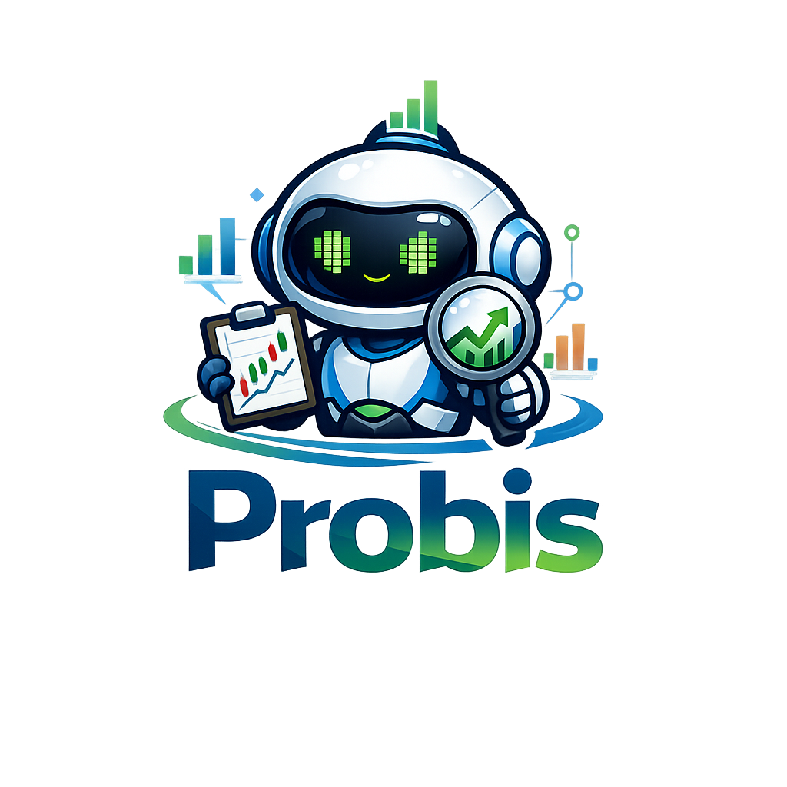
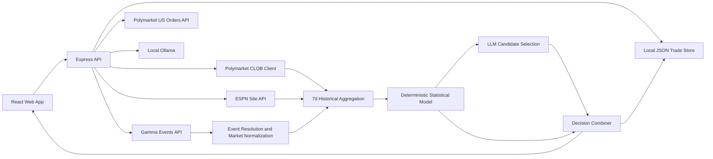
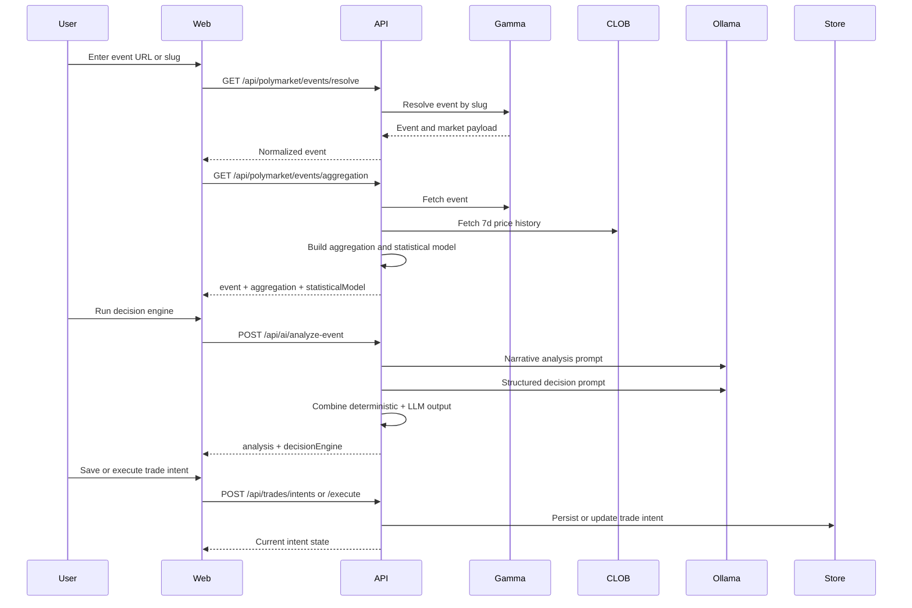
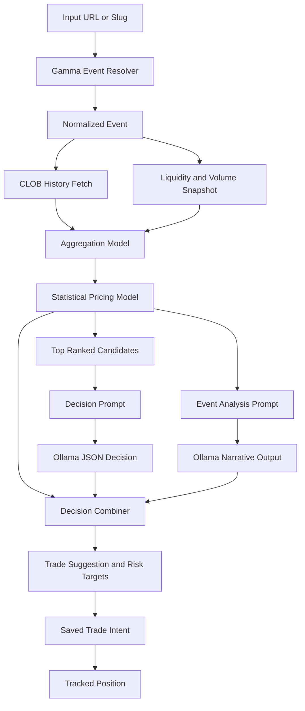

# Probis

Probis is a local-first Polymarket analysis and trade-monitoring system. It combines a deterministic market model, a constrained Ollama layer for explanation and recommendation selection, and an operator UI for reviewing events, saving trade intents, and managing live tracked positions.

The recommendation path stays deterministic-first. The LLM helps explain the setup and choose within allowed candidates, but event resolution, aggregation, scoring, trade shaping, and tracking are handled in code.

The sports path follows the same rule. Team history and matchup features live in the deterministic aggregation and pricing pipeline, not in the Ollama prompt layer.

Live sports context follows the same pattern. Team and league news, game-feed state, and optional social signals are attached during aggregation as `eventIntelligence`, then passed into the prompt layer as supporting context rather than as a separate model.

## Quick Start

You only need Node.js 20+, Ollama, and the default local API URL for a first run.

1. Install dependencies.

```bash
npm install
```

2. Copy `.env.example` to `.env`.

```bash
cp .env.example .env
```

3. Start Ollama and make sure a model is available.

```bash
ollama serve
ollama list
```

4. Start the API and web app.

```bash
npm run dev
```

5. Verify the backend.

```bash
curl http://localhost:4000/health
```

6. Open the app and work through the normal flow.

- Web UI: `http://localhost:5173`
- API: `http://localhost:4000`
- Typical flow: resolve event -> review analytics -> run decision engine -> save intent -> execute -> monitor

### Polymarket US Live Trading Credentials

Live orders require Polymarket US credentials in `.env`.

- `POLYMARKET_US_KEY_ID` or fallback `POLYMARKET_API_KEY`
- `POLYMARKET_US_SECRET_KEY` or fallback `POLYMARKET_PRIVATE_KEY`
- `POLYMARKET_US_BASE_URL` defaults to `https://api.polymarket.us`

The API signs Polymarket US requests with Ed25519 using the standard `timestamp + method + path` format.

### Optional News And Social Providers

ESPN-backed team news, league news, rosters, and scoreboard data work with no extra configuration.

Reddit and X are optional provider hooks. They stay disabled unless you opt in through `.env`.

- `SOCIAL_REDDIT_ENABLED=true` enables Reddit post search.
- `SOCIAL_REDDIT_SUBREDDITS` defaults to `nba,mlb,sportsbook,polymarket`.
- `SOCIAL_REDDIT_USER_AGENT` defaults to `probis/0.1`.
- `SOCIAL_X_BEARER_TOKEN` is required to enable X recent-search results.
- `SOCIAL_X_RECENT_SEARCH_URL` defaults to `https://api.x.com/2/tweets/search/recent`.

Example:

```env
SOCIAL_REDDIT_ENABLED=true
SOCIAL_REDDIT_SUBREDDITS=nba,mlb,sportsbook,polymarket
SOCIAL_REDDIT_USER_AGENT=probis/0.1

SOCIAL_X_BEARER_TOKEN=your_x_api_bearer_token
SOCIAL_X_RECENT_SEARCH_URL=https://api.x.com/2/tweets/search/recent
```

## What The Current Codebase Does

- Resolves events from a Polymarket URL or slug.
- Pulls active event and market data, with US-market-aware fallback handling.
- Builds 7-day market history and aggregation snapshots.
- Recognizes supported team-vs-team sports markets from a local Polymarket US team universe snapshot.
- Loads local team history and derives Elo-style matchup features for recognized sports markets.
- Adds ESPN-backed event intelligence for supported NBA and MLB matchups, including game feed, team news, and player-aware article ranking.
- Optionally merges Reddit and X posts into the same event-intelligence payload when provider env keys are configured.
- Scores markets and outcomes with a deterministic statistical model.
- Uses Ollama for event analysis and constrained recommendation selection.
- Produces a single decision payload with action, edge, EV, confidence, and risk targets.
- Saves trade intents to a local JSON store.
- Executes live buy and sell orders through Polymarket US.
- Tracks positions from venue order fills instead of relying only on portfolio snapshots.
- Detects manual or external sells from venue history.
- Monitors active trades with stop-loss, take-profit, unrealized P/L, and manual cash-out controls.
- Surfaces account identity and buying power in the UI when credentials are configured.

## Workspace Layout

```text
.
├── apps/
│   ├── api/
│   │   ├── package.json
│   │   └── src/
│   │       ├── config/
│   │       │   └── env.js
│   │       ├── lib/
│   │       │   └── logger.js
│   │       ├── routes/
│   │       │   ├── ai.js
│   │       │   ├── health.js
│   │       │   ├── polymarket.js
│   │       │   ├── sports.js
│   │       │   └── trades.js
│   │       └── services/
│   │           ├── decision-engine.js
│   │           ├── ollama.js
│   │           ├── sports/
│   │           │   ├── aggregation.js
│   │           │   ├── auto-sync.js
│   │           │   ├── backtest.js
│   │           │   ├── canonicalization.js
│   │           │   ├── elo-model.js
│   │           │   ├── event-intelligence.js
│   │           │   ├── history-store.js
│   │           │   ├── mlb-importer.js
│   │           │   └── nba-importer.js
│   │           ├── trade-intents.js
│   │           └── polymarket/
│   │               ├── aggregation.js
│   │               ├── client.js
│   │               ├── event-data.js
│   │               ├── gamma.js
│   │               ├── statistical-model.js
│   │               └── us-orders.js
│   └── web/
│       ├── package.json
│       └── src/
│           ├── App.jsx
│           ├── components/
│           ├── features/
│           ├── lib/
│           │   └── api.js
│           ├── main.jsx
│           └── styles.css
├── data/
│   ├── trade-intents.json
│   └── sports/
│       ├── polymarket-us-teams.json
│       └── team-history.json
├── scripts/
│   ├── check-orders-and-positions.js
│   └── sync-polymarket-us-sports-universe.js
├── .env.example
├── package.json
└── plan.md
```

## Runtime Architecture



## System Design

### 1. API Layer

The API lives in `apps/api` and is split into five route groups.

- `GET /health`
  Returns service timestamp plus Polymarket and Ollama status.
- `GET /api/polymarket/*`
  Handles event discovery, event resolution, analytics resolution, cache invalidation, and account identity.
- `GET|POST /api/sports/*`
  Handles sports status, event inspection, NBA/MLB history imports, and backtesting.
- `GET|POST /api/ai/*`
  Handles Ollama status, prompt smoke tests, and full event analysis plus decision output.
- `GET|POST|PATCH|DELETE /api/trades/*`
  Handles trade-intent storage, execution, polling, sell, stop, and close actions.

### 2. Data Providers

The current system uses six external sources plus one local store.

- Gamma API for event and market discovery.
- Polymarket CLOB client for public reads and history retrieval.
- Polymarket US API for signed trading, balances, and account identity.
- ESPN Site API for NBA/MLB scoreboards, rosters, and team or league news.
- Optional Reddit recent-search inputs for extra live context when configured.
- Optional X recent-search inputs for extra live context when configured.
- Local JSON persistence in `data/trade-intents.json`.

### 3. Frontend Operator Console

The React app in `apps/web` is an analyst console and live trade monitor.

1. Load service status, account details, and active events.
2. Resolve an event by URL or slug.
3. Review live markets, history, and model output.
4. Run the decision engine.
5. Adjust stake and risk controls.
6. Save or edit the trade intent.
7. Execute the intent into tracking.
8. Monitor active positions and manage exits from the Trade Center.

## End-to-End Flow



## Decision Engine Architecture

The engine is intentionally split into small stages.

### Model 1: Event Resolution Model

Implemented in `apps/api/src/services/polymarket/gamma.js`.

Purpose:

- Resolve a valid event from a URL or slug.
- Normalize event and market payloads into a stable shape.
- Recover from slug mismatches with active-event fallback matching.

### Model 2: Aggregation Model

Implemented in `apps/api/src/services/polymarket/aggregation.js`.

Purpose:

- Build a short-horizon analytics snapshot from live market state and 7-day history.
- Enrich recognized sports matchups with deterministic team-history features from the local sports store.

Outputs include:

- `liquiditySnapshot`
- `derivedMetrics`
- `historicalPrices`
- `sportsContext`
- `eventIntelligence`

### Model 3: Statistical Pricing Model

Implemented in `apps/api/src/services/polymarket/statistical-model.js`.

Purpose:

- Estimate fair probability for each outcome.
- Quantify edge and confidence from observable market behavior.
- Blend sports fair probabilities into recognized team-vs-team markets without involving the LLM.

Core inputs:

- current probability
- momentum
- historical anchor
- volatility
- liquidity share
- volume share
- team Elo
- home edge when matchup orientation is known
- recent form
- rest days
- rolling score differential

For each outcome, the model returns estimated probability, edge, confidence, and feature diagnostics.

## Sports Data Pipeline

The first-pass sports implementation is deterministic and local.

1. `npm run sync:sports-universe`
  Reads active Polymarket US markets from signed `/v1/markets` and snapshots recognized team outcomes into `data/sports/polymarket-us-teams.json`.
2. Import NBA history with `npm run import:nba-history`
  The first importer uses ESPN NBA scoreboard data and stores finalized games in `data/sports/team-history.json`.
  You can pass `SEASON=2023-24` or explicit `START_DATE` and `END_DATE`. The importer fetches date ranges in batches so full-season imports are practical.
  To load the full calibration sample from 2020 forward, run `npm run import:nba-history:all`.
3. Import MLB history with `npm run import:mlb-history`
  The MLB importer uses ESPN MLB scoreboard data, supports single-year seasons like `SEASON=2024`, and can load the full sample from 2020 forward with `npm run import:mlb-history:all`.
  You can evaluate the same deterministic calibration stack with `npm run backtest:mlb`.
4. Populate or extend `data/sports/team-history.json`
  The model expects rows like `league`, `date`, `homeTeamId`, `awayTeamId`, `homeScore`, and `awayScore`.
5. Run normal event aggregation
  Recognized team-vs-team markets get a `sportsContext` block plus Elo-derived fair probabilities that are blended into Model 3.
6. Attach live event intelligence
  Supported NBA and MLB events also get an `eventIntelligence` block sourced from ESPN news, rosters, and game feeds, with optional Reddit/X posts merged in when configured.
  Article ranking is impact-weighted so injuries, availability changes, lineup changes, suspensions, and transactions are promoted ahead of generic rankings, recap, tracker, and how-to-watch headlines.

If the local sports files are empty, Probis falls back to the existing market-only model.

### Sports Endpoints

- `GET /api/sports/status`
  Returns local sports universe and history-store counts.
- `POST /api/sports/import/nba`
  Imports NBA history with optional JSON body fields `season`, `startDate`, `endDate`, and `batchSize`.
- `POST /api/sports/import/mlb`
  Imports MLB history with optional JSON body fields `season`, `startDate`, `endDate`, and `batchSize`.
- `GET /api/sports/events/inspect?input=...`
  Returns recognized sports markets plus derived Elo features for a Polymarket event.
- `POST /api/sports/backtest`
  Runs deterministic backtesting on the local history store. Accepts `league`, `startDate`, `endDate`, `phase`, `minTrainingGames`, and `calibrationBucketSize`.

### Sports Backtesting

The sports backtest now evaluates both the raw Elo estimate and the calibrated post-model probability used in live pricing.

- Prediction target: home-team win probability
- Metrics: accuracy, Brier score, and log loss for both raw and calibrated probabilities
- Warm-up: controlled by `minTrainingGames` so very early-season games do not dominate the evaluation
- Calibration output: probability buckets with average prediction, empirical win rate, isotonic-smoothed target, and calibration gap
- Phase split: `phase=all` also returns separate regular-season and playoff summaries so you can see whether postseason games distort the model
- Live pricing: recognized sports markets now use a post-model calibration layer that applies logistic compression plus isotonic-style bucket mapping to reduce tail overconfidence before edge is computed

Conceptually, the model starts from the current market price and adjusts it with trend and anchor terms:

$$
	ext{rawEstimate} = p_{\mathrm{current}} + (\text{momentum} \times w_{\mathrm{trend}}) + ((\text{anchor} - p_{\mathrm{current}}) \times w_{\mathrm{anchor}})
$$

It then applies normalization and volatility-aware shrinkage.

### Model 4: LLM Analysis Model

Implemented in `apps/api/src/services/ollama.js`.

Purpose:

- Produce a short human-readable explanation of the event, opportunity, and risk.

This layer is explanatory, not authoritative.

### Model 5: LLM Candidate Selection Model

Implemented in `apps/api/src/services/ollama.js`.

Purpose:

- Choose one recommendation from allowed candidates.
- Return structured JSON only.

Constraint:

- The model is not allowed to invent a market or outcome.
- Fallback logic keeps a valid recommendation even when the ideal modeled candidate is missing.

### Model 6: Final Recommendation Combiner

Implemented in `apps/api/src/services/decision-engine.js`.

Purpose:

- Merge deterministic ranking with the structured LLM selection.
- Convert that into an action, EV estimate, stake suggestion, and risk targets.

The EV calculation is:

$$
EV = \frac{p_{model}}{p_{market}} - 1
$$

Outputs include:

- `action`
- `recommendation.marketQuestion`
- `recommendation.outcomeLabel`
- `currentProbability`
- `modelProbability`
- `edge`
- `expectedValuePerDollar`
- `combinedConfidence`
- `suggestedStakeFraction`
- `stopLossProbability`
- `takeProfitProbability`
- `riskRewardRatio`

## Engine Dataflow



## Caching Design

Implemented in `apps/api/src/services/polymarket/event-data.js`.

Behavior:

- Analytics are cached in memory by normalized event slug.
- Cache TTL is controlled by `ANALYTICS_CACHE_TTL_MS`.
- `refresh=true` bypasses cache for one request.
- `POST /api/polymarket/events/aggregation/invalidate` clears one event or all cached analytics.

## Trade Intent Lifecycle

Implemented in `apps/api/src/services/trade-intents.js`.

Current lifecycle:

1. Build and validate an intent payload.
2. Persist it to local JSON.
3. Derive an execution-request shape.
4. Resolve market metadata and submit a live buy on execute.
5. Move the intent to `tracking` with stop-loss and take-profit thresholds.
6. Poll tracked positions against live venue state and current probability.
7. Trigger live sells for manual exits or threshold hits.

Important current behavior:

- Live trading is routed through Polymarket US.
- Outcome intent mapping supports YES/NO and named outcomes.
- Position state is reconciled from order fills, not only portfolio snapshots.
- External or manual sells can be detected from venue history.
- Sell exits stay open only when the venue actually has a non-terminal pending exit.
- If a venue exit expires or is rejected, the trade remains active and is marked as a failed exit instead of being falsely closed.

## Frontend UX Architecture

Implemented primarily in `apps/web/src/App.jsx`.

The UI is built around one operator workflow:

1. Inspect service status, account identity, and buying power.
2. Pick an active event or paste a direct URL.
3. Review live markets, historical context, and model overlays.
4. Run the decision engine.
5. Preview stake, EV, stop-loss, take-profit, and risk/reward.
6. Save, edit, delete, execute, stop, sell, or close intents.
7. Monitor active trades with auto-refresh, unrealized P/L, and exit state badges.

The frontend also keeps a local draft in browser storage so in-progress analysis survives a refresh.

## Configuration

Environment variables currently used by the codebase:

```bash
POLYMARKET_API_KEY=
POLYMARKET_PRIVATE_KEY=
POLYMARKET_US_KEY_ID=
POLYMARKET_US_SECRET_KEY=
POLYMARKET_US_BASE_URL=https://api.polymarket.us
POLYMARKET_US_GATEWAY_URL=https://gateway.polymarket.us
GAMMA_BASE_URL=https://gamma-api.polymarket.com
PORT=4000
VITE_API_BASE_URL=http://localhost:4000
OLLAMA_BASE_URL=http://localhost:11434
OLLAMA_MODEL=gemma3:latest
ANALYTICS_CACHE_TTL_MS=300000
SOCIAL_REDDIT_ENABLED=true
SOCIAL_REDDIT_SUBREDDITS=nba,mlb,sportsbook,polymarket
SOCIAL_REDDIT_USER_AGENT=probis/0.1
SOCIAL_X_BEARER_TOKEN=your_x_api_bearer_token
SOCIAL_X_RECENT_SEARCH_URL=https://api.x.com/2/tweets/search/recent
```

Notes:

- Gamma reads and analytics still work without trading credentials.
- Ollama must be running locally with an available model.
- Polymarket US credentials are only required for live trading and account-level reads.

## Development

Requirements:

- Node.js 20+
- A local Ollama instance for AI routes
- Polymarket credentials if you want authenticated trading and account checks

Install and run:

```bash
npm install
npm run dev
```

Useful commands:

```bash
npm run dev:api
npm run dev:web
npm run build
npm run start
curl http://localhost:4000/health
```

## API Surface

### Health and status

- `GET /`
- `GET /health`
- `GET /api/polymarket/status`
- `GET /api/polymarket/account-identity`
- `GET /api/ai/status`

### Event discovery and analytics

- `GET /api/polymarket/events?limit=10&offset=0`
- `GET /api/polymarket/events/resolve?input=<url-or-slug>`
- `GET /api/polymarket/events/aggregation?input=<url-or-slug>`
- `GET /api/polymarket/events/aggregation?input=<url-or-slug>&refresh=true`
- `POST /api/polymarket/events/aggregation/invalidate`

### Sports data and calibration

- `GET /api/sports/status`
- `GET /api/sports/events/inspect?input=<url-or-slug>`
- `GET /api/sports/events/inspect?input=<url-or-slug>&refresh=true`
- `POST /api/sports/import/nba`
- `POST /api/sports/import/mlb`
- `POST /api/sports/backtest`

### AI and decision support

- `POST /api/ai/test`
- `POST /api/ai/analyze-event`

### Trade intent storage

- `GET /api/trades/intents?limit=6`
- `POST /api/trades/intents`
- `PATCH /api/trades/intents/:id`
- `DELETE /api/trades/intents/:id`
- `POST /api/trades/intents/:id/execute`
- `POST /api/trades/intents/poll`
- `POST /api/trades/intents/:id/poll`
- `POST /api/trades/intents/:id/sell`
- `POST /api/trades/intents/:id/stop`
- `POST /api/trades/intents/:id/close`

## API Examples

These examples are intentionally short. Actual payloads include more fields.

### 1. Health check

Request:

```bash
curl http://localhost:4000/health
```

Response:

```json
{
  "ok": true,
  "service": "probis-api",
  "timestamp": "2026-04-15T18:42:10.000Z",
  "polymarket": {
    "configured": false,
    "host": "https://clob.polymarket.com",
    "chainId": 137,
    "usTrading": {
      "configured": false,
      "authenticated": false,
      "buyingPower": null
    },
    "publicReadOk": true
  },
  "ollama": {
    "reachable": true,
    "requestedModel": "gemma3:latest",
    "resolvedModel": "gemma3:latest"
  }
}
```

### 2. Resolve an event

Request:

```bash
curl "http://localhost:4000/api/polymarket/events/resolve?input=https://polymarket.com/event/will-the-fed-cut-rates-in-june"
```

Response:

```json
{
  "ok": true,
  "event": {
    "slug": "will-the-fed-cut-rates-in-june",
    "title": "Will the Fed cut rates in June?",
    "active": true,
    "closed": false,
    "markets": [
      {
        "question": "Will the Fed cut rates in June?",
        "conditionId": "0xabc123",
        "slug": "will-the-fed-cut-rates-in-june",
        "outcomes": [
          { "label": "Yes", "probability": 0.42 },
          { "label": "No", "probability": 0.58 }
        ]
      }
    ]
  }
}
```

### 3. Resolve event analytics

Request:

```bash
curl "http://localhost:4000/api/polymarket/events/aggregation?input=will-the-fed-cut-rates-in-june"
```

Response:

```json
{
  "ok": true,
  "event": {
    "slug": "will-the-fed-cut-rates-in-june",
    "title": "Will the Fed cut rates in June?"
  },
  "aggregation": {
    "generatedAt": "2026-04-15T18:45:00.000Z",
    "derivedMetrics": {
      "topOutcome": {
        "question": "Will the Fed cut rates in June?",
        "label": "No",
        "probability": 0.58
      }
    }
  },
  "statisticalModel": {
    "summary": {
      "bestOpportunity": {
        "question": "Will the Fed cut rates in June?",
        "label": "Yes",
        "edge": 0.05,
        "confidence": 0.64
      }
    }
  }
}
```

### 4. Run the AI analysis and decision engine

Request:

```bash
curl -X POST http://localhost:4000/api/ai/analyze-event \
  -H "Content-Type: application/json" \
  -d '{"input":"will-the-fed-cut-rates-in-june"}'
```

Response:

```json
{
  "ok": true,
  "analysis": "- Event state: ...\n- Strongest setup: ...\n- Key risk: ...",
  "decisionEngine": {
    "action": "buy",
    "recommendation": {
      "marketQuestion": "Will the Fed cut rates in June?",
      "outcomeLabel": "Yes",
      "currentProbability": 0.42,
      "modelProbability": 0.47,
      "edge": 0.05,
      "expectedValuePerDollar": 0.119,
      "combinedConfidence": 0.67,
      "suggestedStakeFraction": 0.134,
      "stopLossProbability": 0.39,
      "takeProfitProbability": 0.48
    }
  }
}
```

### 5. Save a trade intent

Request:

```bash
curl -X POST http://localhost:4000/api/trades/intents \
  -H "Content-Type: application/json" \
  -d '{
    "eventSlug": "will-the-fed-cut-rates-in-june",
    "eventTitle": "Will the Fed cut rates in June?",
    "conditionId": "0xabc123",
    "marketQuestion": "Will the Fed cut rates in June?",
    "outcomeLabel": "Yes",
    "action": "buy",
    "tradeAmount": 100,
    "recommendation": {
      "currentProbability": 0.42,
      "modelProbability": 0.47,
      "edge": 0.05
    },
    "tradeSuggestion": {
      "amount": 100,
      "stopLossProbability": 0.39,
      "takeProfitProbability": 0.48
    }
  }'
```

Response:

```json
{
  "ok": true,
  "intent": {
    "id": "9f4cf9c3-faf9-4f8f-84fa-0fa5244f0fd4",
    "status": "confirmed",
    "eventSlug": "will-the-fed-cut-rates-in-june",
    "marketQuestion": "Will the Fed cut rates in June?",
    "outcomeLabel": "Yes",
    "tradeAmount": 100,
    "executionRequest": {
      "venue": "polymarket-us",
      "side": "buy",
      "entryProbability": 0.42,
      "sharesEstimate": 238.09523809523807
    }
  }
}
```

### 6. Start tracking a saved trade intent

Request:

```bash
curl -X POST http://localhost:4000/api/trades/intents/9f4cf9c3-faf9-4f8f-84fa-0fa5244f0fd4/execute
```

Response:

```json
{
  "ok": true,
  "intent": {
    "id": "9f4cf9c3-faf9-4f8f-84fa-0fa5244f0fd4",
    "status": "tracking",
    "monitoring": {
      "state": "active",
      "currentProbability": 0.42,
      "entryProbability": 0.42,
      "stopLossProbability": 0.39,
      "takeProfitProbability": 0.48
    }
  }
}
```

## Current Boundaries

What this repo does today:

- event discovery and normalization
- market history aggregation
- deterministic opportunity scoring
- local LLM-assisted analysis and constrained recommendation selection
- risk-target generation
- trade intent persistence
- live buy and sell execution through Polymarket US
- tracked-position polling with stop-loss and take-profit evaluation
- manual overrides for sell, stop, and close actions
- Trade Center monitoring with unrealized P/L and exit state display

What this repo does not do yet:

- portfolio accounting
- backtesting or model-evaluation tooling
- multi-venue routing
- fully autonomous strategy deployment without operator review

## Practical Summary

Probis is a layered decision-support stack:

1. Resolve and normalize market data.
2. Aggregate short-horizon market history.
3. Score outcomes with deterministic logic.
4. Let the LLM explain and select only within bounded candidates.
5. Turn that into an operator-facing trade suggestion.
6. Execute, track, and manage live intents from the Trade Center.

That keeps the hot path grounded in market data and code while still giving the operator a fast interface for review, execution, and live monitoring.