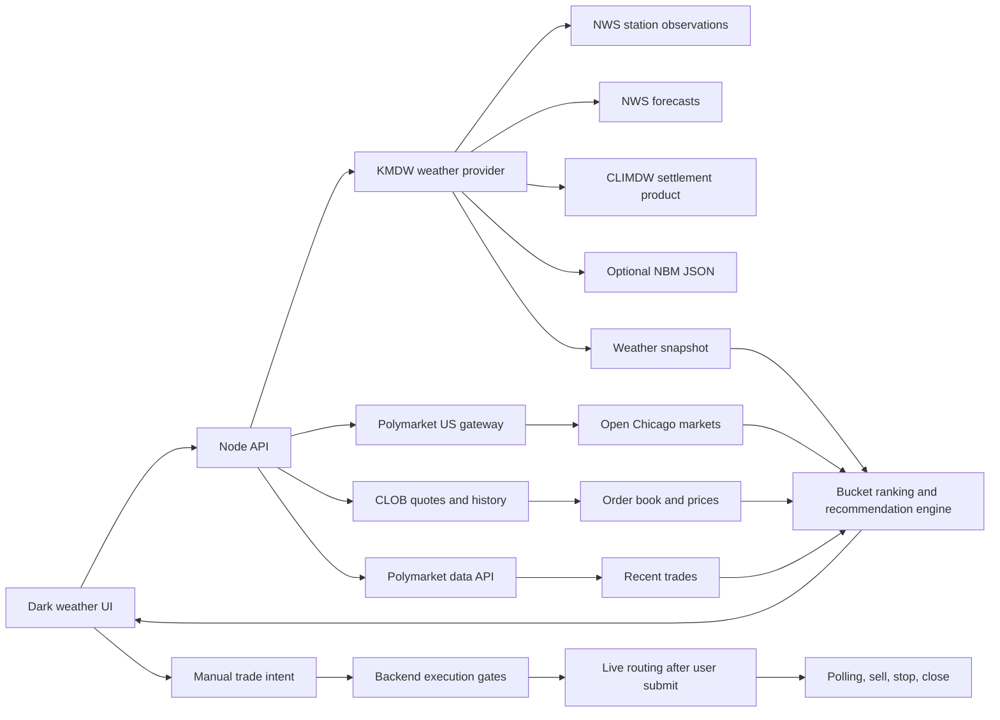
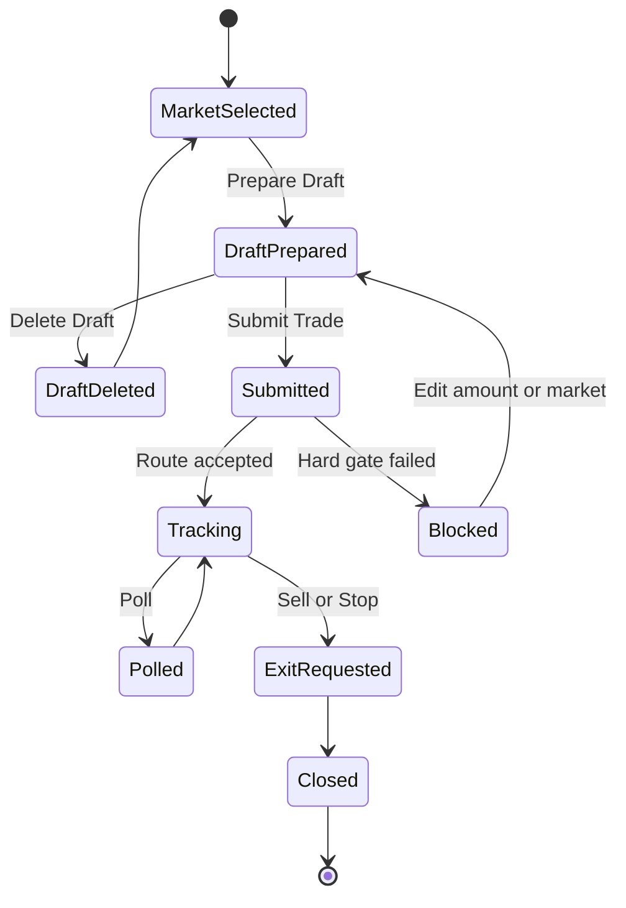
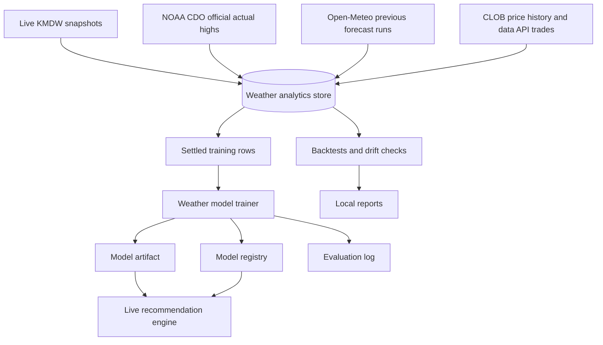

# Probis — Open-Source Polymarket Terminal

Probis is a local-first, open-source terminal for **Polymarket US**. Bring your own API key, run it on localhost, and keep custody of everything — keys never leave your machine.

The project is being built toward three headlines:

1. **Connect your key, see everything.** Every open Polymarket US market with live quotes, order book, price history, attached news feeds, authoritative data sources, and past comparable markets.
2. **Get a recommendation.** A model layer ranks the best trades available *right now* — fair probability, edge after execution cost, confidence, and suggested size.
3. **Turn on agent mode.** An agent that enters, manages, and exits positions inside hard risk limits you set, with a full audit trail and a kill switch.

**Weather is the first market family, not the product.** Chicago (KMDW) daily high-temperature markets are the proof that the data → model → backtest → execution pipeline works end to end. That stack is being generalized, not rewritten.

> [!IMPORTANT]
> **This repository is mid-pivot.** The weather family below is fully built and working today. The general terminal, the cross-market recommender, and agent mode are planned work. See [REFACTOR-PLAN.md](REFACTOR-PLAN.md) for the phased plan, and the status table below for what actually runs right now.

## Status

| Capability | State |
|---|---|
| Chicago (KMDW) weather markets: discovery, model, backtest, trading | ✅ **Working today** |
| Human-in-the-loop trade lifecycle (draft → submit → poll → sell/stop/close) | ✅ **Working today** |
| Local analytics store, model training, evaluation, drift + alerts | ✅ **Working today** |
| Extraction refactor (`core/`, `families/` layout; weather unchanged) | ✅ **Working today** |
| Read-only catalog of every open Polymarket US market (`/api/markets`) | ✅ **Working today** |
| Persisted catalog, per-market news feeds, scheduler, terminal UI (`apps/tui`) | 🚧 Planned — Phase 1 |
| Cross-market recommender, crypto + econ families, screened tier | 🚧 Planned — Phase 2 |
| Agent mode, chat interface, MCP server | 🚧 Planned — Phase 3 |

Nothing marked 🚧 exists in the tree yet. Paths referenced in this README are paths that exist today.

### Layout after Phase 0

```
apps/api/src/
├── core/                    # family-agnostic machinery
│   ├── polymarket/          # venue layer: client, clob, data-api, gamma, us-orders, history
│   ├── engine/              # fusion, gating, sizing, execution-cost, number
│   └── catalog/             # all open Polymarket US markets, normalized + family-tagged
├── families/
│   ├── registry.js          # the market-family-v1 plugin contract
│   └── weather/             # the weather family, conforming to that contract
├── routes/                  # markets.js (new) + weather.js, trades.js, polymarket.js, ai.js
└── services/                # weather stack, ML, persistence, and the Phase 2 screening files
```

`core/` never imports from `families/` or `services/`. The weather family supplies its own
event filter, station, and family resolver to the venue layer rather than the venue layer
knowing about weather.

**Market discovery uses two paths.** The Polymarket US `/events` listing does not return
temperature markets — those are only reachable through gateway search. The catalog therefore
merges the venue listing with markets each family discovers for itself, deduped by condition
id. A family contributes via the optional `catalogMarkets()` method. Full paginated ingestion
with persistence is Phase 1.

## Scope Decisions

- **Polymarket US only.** The venue layer stays isolated so a second venue is cheap later, but none is planned.
- **No Twitter/X.** News comes from RSS/Atom, GDELT, and official sources.
- **Open source, BYO keys, localhost only.** No hosted or multi-user mode.
- **Not a market-making platform.** This is a trading terminal.

---

# What Works Today: The Weather Family

Probis discovers, prices, and trades Chicago Midway (`KMDW`) daily high-temperature markets on Polymarket US.

## What It Does

- **Discovers** open and upcoming Chicago weather markets from the Polymarket US gateway.
- **Ingests** the data that actually settles and predicts these markets:
  - NWS station observations for KMDW (intraday temperature path)
  - NWS hourly/grid forecasts
  - The official `CLIMDW` NWS climate report used for settlement
  - Optional NBM (National Blend of Models) guidance
  - Open-Meteo previous-run forecast vintages (for training)
  - NOAA CDO official archived daily highs (ground truth for training/backtests)
  - Live CLOB quotes, order-book depth, and public trade history
- **Predicts** a probability distribution over the day's high temperature, projects it onto the market's temperature buckets, fuses it with the market-implied distribution, and optionally applies a trained ML calibration layer.
- **Recommends** the best bucket by net edge after estimated execution cost, with confidence, spread/liquidity checks, and fractional-Kelly stake sizing.
- **Executes with you in the loop**: prepare a draft, edit the amount, submit, poll, sell, stop, or close. Nothing is routed until you click submit.
- **Learns**: every snapshot, market board, forecast vintage, and settled outcome is persisted locally so the model can be retrained, evaluated, and backtested.

## How Predictions Are Made

1. **Temperature distribution.** Observations, forecasts, settlement state, and time-of-day ("day phase") are combined into an expected daily high with an uncertainty estimate, producing an integer-degree probability distribution ([chicago.js](apps/api/src/services/weather/chicago.js)).
2. **Bucket projection.** The distribution is integrated over each market bucket's temperature range to get weather-only bucket probabilities.
3. **Market fusion.** Market-implied probabilities (from live quotes) are blended in with a weight that adapts to day phase, spread, and source freshness.
4. **ML calibration (optional).** A trained logistic calibrator over ~35 features (forecast values, station bias, spread, depth, day phase, distribution percentiles, …) blends with the simulation probability ([weather-model.js](apps/api/src/services/ml/weather-model.js)).
5. **Edge and gating.** Net edge = fair probability − ask − estimated execution cost. Hard gates block stale data, ambiguous settlement sources, missing firm asks, thin depth, or insufficient edge. Wide spread is a yellow warning, not a blocker.
6. **Sizing.** Fractional Kelly against a configurable research bankroll, always user-overridable.

Steps 3, 5, and 6 are family-agnostic and now live in `core/engine/` (`fusion.js`, `gating.js`, `sizing.js`, `execution-cost.js`), so every future family inherits them. The weather family supplies only what is weather-specific — the day-phase prior on market trust, and the timing score.

## Demo

[Walkthrough video](https://drive.google.com/file/d/1P1RQcepRdpn_mv2iPgkjZIttwSmiNifE/view?usp=sharing) — records the weather-era UI, which is the UI in the repo today.

## Current UI

The web app is centered on one workflow: finding and managing Chicago weather bets. Phase 1 generalizes this into a market list driven by the full catalog, with the weather card becoming one family-specific detail panel.

- `Open Chicago Weather Bets`: ranked cards/rows for current and future open Chicago weather markets returned by Polymarket US.
- Ranking details: market date, bucket, title, entry price, fair probability, edge, spread warning, recommended amount, and estimated shares.
- Trade panel: amount override, recommended amount, estimated shares, entry price, draft preparation, submission, polling, sell, stop, and delete draft actions.
- Status panel: `No Selection`, `Ready`, or `Blocked`, with warning messages shown separately in yellow.
- Defaults the target date to tomorrow after 6 PM America/Chicago, when the current day is typically near settlement.

## Runtime Architecture


```mermaid
flowchart LR
  UI[Dark weather UI] --> API[Node API]

  API --> Provider[KMDW weather provider]
  Provider --> NWSObs[NWS station observations]
  Provider --> NWSForecast[NWS forecasts]
  Provider --> CLIMDW[CLIMDW settlement product]
  Provider --> NBM[Optional NBM JSON]

  API --> PolyGateway[Polymarket US gateway]
  API --> Clob[CLOB quotes and history]
  API --> DataApi[Polymarket data API]

  Provider --> Snapshot[Weather snapshot]
  PolyGateway --> Markets[Open Chicago markets]
  Clob --> Quotes[Order book and prices]
  DataApi --> Trades[Recent trades]

  Snapshot --> Ranker[Bucket ranking and recommendation engine]
  Markets --> Ranker
  Quotes --> Ranker
  Trades --> Ranker

  Ranker --> UI
  UI --> Intent[Manual trade intent]
  Intent --> Gates[Backend execution gates]
  Gates --> Routing[Live routing after user submit]
  Routing --> Tracking[Polling, sell, stop, close]
```

## Trading Workflow


```mermaid
stateDiagram-v2
  [*] --> MarketSelected
  MarketSelected --> DraftPrepared: Prepare Draft
  DraftPrepared --> DraftDeleted: Delete Draft
  DraftDeleted --> MarketSelected
  DraftPrepared --> Submitted: Submit Trade
  Submitted --> Tracking: Route accepted
  Submitted --> Blocked: Hard gate failed
  Tracking --> Polled: Poll
  Polled --> Tracking
  Tracking --> ExitRequested: Sell or Stop
  ExitRequested --> Closed
  Closed --> [*]
  Blocked --> DraftPrepared: Edit amount or market
```

Trades are never fired automatically from a ranking signal. The UI shows the recommendation, the user may change the amount, and the user must click the submit action. If required credentials and routing settings are available, Probis sends the order through the backend execution gates.

Wide bid/ask spread is a warning only. Hard blockers include stale data, settlement-source ambiguity, missing firm ask, ask above max limit, insufficient liquidity/depth, insufficient edge, or other execution-safety failures.

This human-click gate is a permanent property of the system. Agent mode (Phase 3) does not remove it — it adds opt-in levels above it, with the risk envelope enforced *below* the agent so agent code cannot exceed it.

## Data And Training Pipeline


```mermaid
flowchart TD
  LiveSnapshots[Live KMDW snapshots] --> Store[(Weather analytics store)]
  OfficialActuals[NOAA CDO official actual highs] --> Store
  ForecastVintages[Open-Meteo previous forecast runs] --> Store
  MarketBoards[CLOB price history and data API trades] --> Store

  Store --> FeatureRows[Settled training rows]
  FeatureRows --> Trainer[Weather model trainer]
  Trainer --> ModelArtifact[Model artifact]
  Trainer --> Registry[Model registry]
  Trainer --> EvaluationLog[Evaluation log]

  ModelArtifact --> Recommender[Live recommendation engine]
  Registry --> Recommender
  Store --> Backtest[Backtests and drift checks]
  Backtest --> Reports[Local reports]
```

Training works best when the local store has all four data groups:

- Live weather snapshots captured during market hours.
- Official settled daily highs from NOAA CDO.
- Forecast vintages from Open-Meteo previous runs.
- Historical market boards from CLOB price history and public trade data.

## Quick Start

Requirements:

- Node.js 20+
- A copied `.env` file based on `.env.example`
- `NOAA_CDO_TOKEN` for official archive backfills (free token from NOAA CDO)
- Polymarket US credentials for live order routing (optional — everything else works without them)

Install dependencies:

```bash
npm install
```

Copy environment settings:

```bash
cp .env.example .env
```

Run the API and web app:

```bash
npm run dev
```

Default local URLs:

- Web: `http://localhost:5173`
- API: `http://localhost:4000`

Run tests:

```bash
npm test
```

Build the web app:

```bash
npm run build --workspace @probis/web
```

## Weather Data Setup

Required or commonly used environment variables:

```bash
WEATHER_PROVIDER_ID=kmdw-nws-climdw
POLYMARKET_US_GATEWAY_URL=https://gateway.polymarket.us
POLYMARKET_CLOB_BASE_URL=https://clob.polymarket.com
POLYMARKET_DATA_API_BASE_URL=https://data-api.polymarket.com
NOAA_CDO_TOKEN=your_noaa_token
```

Optional weather and discovery settings:

```bash
NBM_ENABLED=true
NBM_JSON_URL=
CHICAGO_MARKET_SEARCH_QUERIES=highest temperature chicago,chicago weather,chicago temperature,chicago midway weather,midway temperature
WEATHER_ML_MODEL_PATH=data/models/weather-high-temp-calibrator.json
```

Live routing requires the relevant Polymarket US credentials and account settings in `.env`. The UI still requires a manual button click before an order is submitted.

## Training Market Data

Backfill official actual highs:

```bash
npm run weather:archive-backfill -- --date-from=2026-05-01 --date-to=2026-06-10
```

Backfill forecast vintages:

```bash
npm run weather:forecast-vintage-backfill -- --date-from=2026-05-01 --date-to=2026-06-10 --lead-days=1,2,3
```

Backfill historical market boards:

```bash
npm run weather:market-board-backfill -- --date-from=2026-05-01 --date-to=2026-06-10 --fidelity-minutes=60
```

Train the KMDW model:

```bash
npm run weather:model-train -- --date-from=2026-05-01 --date-to=2026-06-10 --rolling-folds=4 --min-samples=40 --min-class-samples=5
```

Evaluate the model:

```bash
npm run weather:model-evaluate -- --date-from=2026-05-01 --date-to=2026-06-10
```

Backtest recommendations:

```bash
npm run weather:backtest -- --date-from=2026-05-01 --date-to=2026-06-10 --min-edge=0.06
```

Useful live weather commands:

```bash
npm run weather:snapshot -- --force
npm run weather:source-audit -- --date=2026-06-10
npm run weather:alerts -- --date=2026-06-10 --evaluate=true
```

The main analytics files are written under `data/weather/`:

- `data/weather/kmdw-analytics.sqlite`
- `data/weather/parquet/*.parquet`
- `data/models/weather-high-temp-calibrator.json`

If DuckDB is installed, inspect Parquet coverage with:

```bash
duckdb -c "select target_date, count(*) from 'data/weather/parquet/kmdw_market_snapshots.parquet' group by target_date order by target_date desc;"
```

## API Surface

Phase 0 added the catalog routes; the `/api/weather/*` routes are unchanged and keep working.

- `GET /api/markets` — every open Polymarket US market, normalized and family-tagged
- `GET /api/markets/:id` — one market, with its family (or `null` when unmodeled)
- `GET /api/families` — registered market families and their capabilities
- `GET /api/weather/providers`
- `GET /api/weather/chicago/status`
- `GET /api/weather/chicago/markets`
- `GET /api/weather/chicago/markets/:slug`
- `GET /api/weather/chicago/settlement`
- `GET /api/weather/chicago/snapshot`
- `POST /api/weather/chicago/reprice`
- `POST /api/weather/chicago/intents`
- `GET /api/weather/chicago/history`
- `GET /api/weather/chicago/source-audit`
- `GET /api/weather/chicago/alerts`
- `POST /api/weather/chicago/alerts/evaluate`
- `GET /api/weather/chicago/model`
- `POST /api/weather/chicago/model/train`
- `POST /api/weather/chicago/model/evaluate`
- `GET /api/weather/chicago/archive`
- `POST /api/weather/chicago/archive/backfill`
- `GET /api/weather/chicago/historical-boards`
- `POST /api/weather/chicago/historical-boards/backfill`
- `GET /api/weather/chicago/forecast-vintages`
- `POST /api/weather/chicago/forecast-vintages/backfill`
- `GET /api/weather/chicago/drift`
- `GET /api/weather/chicago/signals`
- `POST /api/weather/backtest`
- `GET /api/weather/chicago/backtest`
- `GET /api/polymarket/chicago/snapshots`
- `GET /api/recommendations/chicago`
- `GET /api/trades/intents`
- `POST /api/trades/intents`
- `PATCH /api/trades/intents/:id`
- `DELETE /api/trades/intents/:id`
- `POST /api/trades/intents/:id/execute`
- `POST /api/trades/intents/poll`
- `POST /api/trades/intents/:id/poll`
- `POST /api/trades/intents/:id/sell`
- `POST /api/trades/intents/:id/stop`
- `POST /api/trades/intents/:id/close`

Other older routes still exist in the codebase, but the current product focus is the weather workflow above.

## Storage

Local-first persistence is used by default.

- Weather analytics: `data/weather/` (SQLite + Parquet)
- Model artifacts, registry, evaluation logs: `data/models/`
- Trade intents: `data/trade-intents.json`
- JSONL fallback stores: `data/weather/*.jsonl`

Postgres can be used where configured, but it is optional for local development. Everything under `data/` is gitignored and stays on your machine.

## Adding More Weather Locations

Within the weather family, the layer is location-agnostic behind [providers.js](apps/api/src/services/weather/providers.js). A location is a registered provider that implements `getTargetDate`, `getClimateDayWindow`, `fetchSettlement`, `fetchObservations`, `fetchForecasts`, `fetchModelForecast`, and `fetchMarkets`. Chicago (`kmdw-nws-climdw`) is the only registered provider today.

What a new city needs — station config, settlement product, market discovery queries, its own model artifact, and route/UI generalization — is summarized in [REFACTOR-PLAN.md](REFACTOR-PLAN.md#8-weather-family--surviving-roadmap-items). This is now an intra-family concern; adding a whole *new* family (crypto, econ) is a different contract, described in the plan's §1.

---

## Where This Is Going

[REFACTOR-PLAN.md](REFACTOR-PLAN.md) is the authoritative plan. In brief:

| Phase | Deliverable |
|---|---|
| **0** | ✅ Done — extraction refactor into `core/` + `families/`; weather behavior unchanged; read-only all-markets catalog |
| **1** | API-key connection, market detail with feeds + past data, scheduler, terminal UI v1 (read-only) |
| **2** | Cross-market recommender, crypto family, screened tier, TUI trading |
| **3** | Agent mode (advise → semi-auto → full), chat, MCP server |
| **4** | Open-source release polish |

A market with no family model stays first-class in the terminal — quotes, book, history, feeds, and rules all render. It just shows no fair-value/edge panel. That is what lets the terminal cover every market while models arrive family by family.

## Documentation

- [REFACTOR-PLAN.md](REFACTOR-PLAN.md) — the phased plan for the general terminal, recommendation layer, and agent mode.
- [AGENTS.md](AGENTS.md) — repository guidelines: structure, commands, style, testing, commit conventions.
- [workers/weather_ml/README.md](workers/weather_ml/README.md) — optional Python trainer for the heavier ML calibration layer.
- [docs/research/weather-markets-research.md](docs/research/weather-markets-research.md) — archived background research on Chicago weather markets, settlement-source risk, and modeling approach. Written before the weather stack was built; kept for the settlement-risk reasoning, not as a current description of the code.

## Current Limitations

- **Only the weather family is modeled.** Chicago Midway daily high-temperature markets are the only markets Probis prices today. The general catalog is Phase 1.
- Open and future market visibility depends on what the Polymarket US gateway returns.
- Market data tracking uses REST polling; streaming is not implemented.
- Model quality depends on how much archive, forecast vintage, and market-board history has been backfilled.
- This is trading software, not financial advice. Weather markets settle off a single designated station and carry settlement-source risk. Review source data and quotes before submitting orders.

## License

See [LICENSE](LICENSE).
