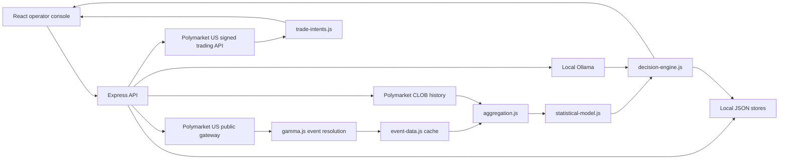
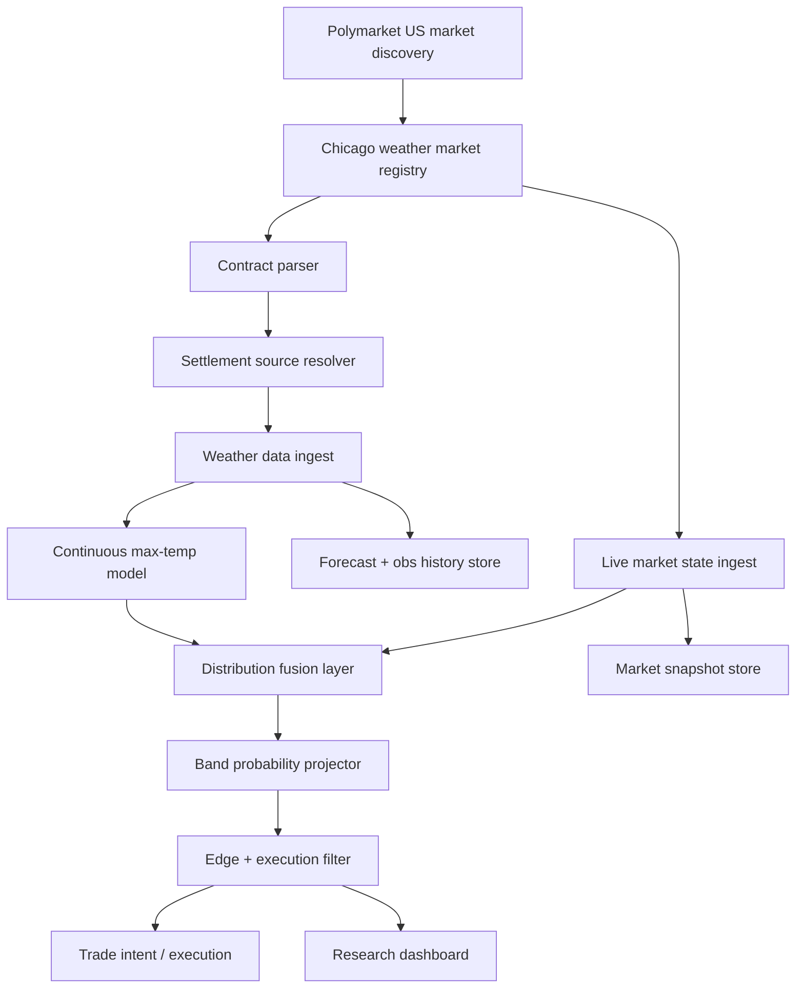
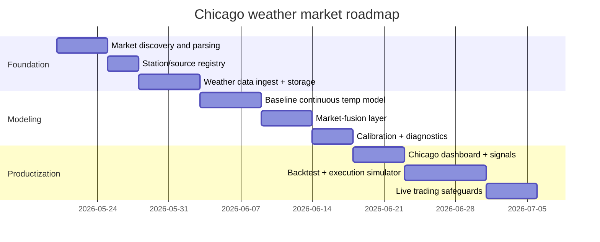

# Probis Improvement Plan for Chicago Weather High-Temperature Markets

## Executive summary

`npyrz/probis` is already a credible local-first Polymarket analysis stack, but today it is optimized for generic event resolution plus a sports-specific enrichment path, not for weather. The backend is an Express API that resolves events from Polymarket, builds a short-horizon aggregation snapshot from market data and seven-day price history, runs a deterministic statistical model, optionally asks Ollama for explanation/recommendation selection, and then stores or executes trade intents through Polymarket US. The codebase already contains a good pattern for domain-specific enrichment via the sports pipeline, but there is no equivalent weather module, no weather-specific features, no weather backtester, no Chicago market registry, and no durable time-series store for forecast/observation histories. fileciteturn4file0 fileciteturn9file0 fileciteturn11file0 fileciteturn15file0 fileciteturn17file0 fileciteturn18file0

The highest-value improvement is **not** to bolt weather onto the existing generic model. The best path is to create a dedicated **weather vertical** parallel to sports: a Chicago market discovery layer, a weather-source normalization layer, a continuous maximum-temperature model that converts to contract-band probabilities, a real-time updater that ingests live market prices and official observations, and a backtesting stack that evaluates both forecast quality and net trading P&L. This should remain deterministic-first, with the LLM limited to explanation and operator workflow support, matching the project’s current design philosophy. fileciteturn4file0 fileciteturn22file0

For Chicago specifically, the authoritative local weather ecosystem is clear even though the exact Polymarket Chicago contract page could not be retrieved in this pass. NWS Chicago’s observations page prominently exposes Chicago-area observation sites including **Chicago-O’Hare (KORD)**, **Chicago Midway (KMDW)**, and **Chicago Northerly Island**, while NWS climate tooling explicitly says its NOWData/local climate interface is unofficial and that **official climate records live at NOAA NCEI**. Public airport metadata surfaced in search results identifies O’Hare as **ICAO KORD / WMO 72530** and Midway as **ICAO KMDW / WMO 72534**. citeturn30view0turn32view0turn33view0turn31view2turn37view0turn39search0turn39search1

The key unresolved issue is **contract-specific settlement location**. Public reporting on Polymarket weather markets shows that these markets can settle off a **single designated station/instrument** rather than a citywide average: the Financial Times reports Paris high-temperature wagers were settled using **Météo-France data recorded at Charles de Gaulle**, while the Wall Street Journal reports Polymarket weather betting has relied on third-party data such as **Weather Underground**. That strongly implies Chicago contracts also depend on a specifically designated source/station, but the exact Chicago rule text and station name were **not directly verified** from a retrievable Chicago rule page in this research pass. Operationally, that means automated trading should be blocked until the contract source is confirmed per market. citeturn42news1turn4news3turn13news3

My bottom-line recommendation is to implement a **Chicago weather module** in three layers. First, build a market catalog that finds all current-day and upcoming Chicago weather contracts and parses their settlement metadata. Second, model the daily high as a continuous distribution using official observations plus NWS forecasts and live market prices, then project that distribution into contract-band probabilities. Third, trade only when the model edge survives fees, spread, slippage, and settlement-source risk, using fractional Kelly with hard caps and aggressive downgrade rules when the designated station is vulnerable or ambiguous. That design is materially better aligned with Chicago weather-high betting markets than the current market-momentum-plus-sports architecture. fileciteturn17file0 fileciteturn18file0 fileciteturn21file0 citeturn29view0turn30view0turn31view2turn42news1turn4news3

## Current Probis architecture and weather-market fit

The repository is a monorepo with two applications, `apps/api` and `apps/web`, plus local JSON data stores under `data/` and a sports-specific data subtree under `data/sports/`. The root scripts already support API/web development, sports-universe sync, sports history imports, and sports backtesting. That matters because the repo already shows how the author likes to add a domain-specific vertical: via local data files, importer/sync jobs, deterministic enrichment, and explicit backtest commands. fileciteturn4file0 fileciteturn6file0

The API entrypoint mounts five router groups: health, polymarket, sports, AI, and trades. The Polymarket routes expose status, account identity, active events, event resolution, and event aggregation. The AI route calls `resolveEventAnalytics`, builds analysis and decision prompts for Ollama, and then merges LLM output with deterministic model output. The trades route persists intents and supports execute, poll, sell, stop, and close. On the frontend, the current operator console is wired around that same lifecycle: fetch status, browse/resolve an event, inspect aggregation, run analysis, save intent, execute, and monitor. fileciteturn9file0 fileciteturn11file0 fileciteturn12file0 fileciteturn13file0 fileciteturn25file0 fileciteturn26file0

The central data path is:



That diagram is not hypothetical; it is the shape expressed by the README, the route files, and the service implementations. `event-data.js` fetches the event, optionally auto-syncs sports history, builds aggregation, runs the statistical model, and caches the result in memory by normalized slug. `aggregation.js` pulls seven days of price history from the Polymarket CLOB and adds liquidity/volume summaries. `statistical-model.js` then scores outcomes using current probability, seven-day history summaries, liquidity share, volume share, and sports-only fair-probability blends when applicable. fileciteturn4file0 fileciteturn15file0 fileciteturn17file0 fileciteturn18file0

### Repo module map

The table below focuses on the modules most relevant to weather-market integration.

| Module / file | Current role | Why it matters for Chicago weather | Evidence |
|---|---|---|---|
| `README.md` | Canonical repo overview, architecture, endpoints, workspace tree | Confirms deterministic-first design and existing sports-only domain specialization | fileciteturn4file0 |
| `package.json` | Monorepo scripts, sports import/backtest commands | Shows existing pattern for domain imports and backtests that weather should mirror | fileciteturn6file0 |
| `apps/api/src/index.js` | Express bootstrap, router mounting | Weather should be added as a first-class route group, not buried in generic polymarket routes | fileciteturn9file0 |
| `apps/api/src/config/env.js` | Runtime config and cache TTL | Add weather-provider config, station map, and refresh intervals here | fileciteturn10file0 |
| `routes/polymarket.js` | Status, account identity, active events, resolve, aggregation | Reuse for raw Polymarket fetching, but split weather discovery into dedicated routes | fileciteturn11file0 |
| `routes/ai.js` | Analysis + decision workflow | Keep LLM in explanation mode for weather too; do not let it own pricing | fileciteturn12file0 |
| `routes/trades.js` | Intent CRUD, execute, poll, sell, stop, close | Weather trading can reuse this lifecycle, but needs tighter intraday polling and source-risk flags | fileciteturn13file0 |
| `services/polymarket/gamma.js` | Event normalization and fallback resolution | Extend with city/topic filters to discover all Chicago weather markets, not just one slug at a time | fileciteturn16file0 |
| `services/polymarket/event-data.js` | Aggregation/model cache orchestration | Good place to branch weather analytics cache by event/date/station | fileciteturn15file0 |
| `services/polymarket/aggregation.js` | Seven-day price history, liquidity/volume snapshots | Too generic today; needs weather forecasts, obs, and station metadata merged in | fileciteturn17file0 |
| `services/polymarket/statistical-model.js` | Current deterministic pricing model | Present model is weather-inadequate because it blends only market microstructure and sports features | fileciteturn18file0 |
| `services/decision-engine.js` | Final trade recommendation, EV, stake fraction, stop/take-profit | Reusable, but edge inputs need a weather-calibrated model first | fileciteturn22file0 |
| `services/polymarket/us-orders.js` | Signed Polymarket US market/account/order access | Already contains the practical trading plumbing for live deployment | fileciteturn21file0 |
| `services/trade-intents.js` | Local JSON persistence and venue reconciliation | Adequate for small-scale operator workflow, but not ideal for dense intraday weather experimentation | fileciteturn23file0 fileciteturn24file0 |
| `services/sports/*` | Domain-specific enrichment, auto-sync, history store, backtest | The exact architectural template weather should imitate | fileciteturn29file0 fileciteturn30file0 fileciteturn31file0 fileciteturn32file0 |
| `apps/web/src/lib/api.js` | Frontend API wrapper | Needs new weather endpoints for Chicago discovery, forecast overlays, and signal panels | fileciteturn25file0 |

### Limitations that matter for weather integration

The current system has six limitations that are directly relevant to Chicago temperature betting.

First, Probis is **single-event centric**. The frontend and API are organized around resolving one event from a slug/URL rather than cataloging all events for one city/day/category. Chicago weather betting needs the opposite: a city-level market board that shows current day plus upcoming days together. fileciteturn11file0 fileciteturn25file0

Second, the existing aggregation horizon is **seven days with 1,440-minute fidelity**. That is workable for broad event context, but too coarse for intraday temperature markets where the last few forecast cycles and observation updates matter disproportionately, especially from late morning through the daily maximum window. fileciteturn17file0

Third, the statistical model is explicitly a **hybrid market-and-sports model**. Its named methodology and feature set include market probability/history/liquidity plus sports features such as Elo, home edge, rest days, and probable starters. None of that is meaningful for airport-station daily-max temperature pricing. fileciteturn18file0

Fourth, the repo’s durable storage is **local JSON**, while analytics caching is **in-memory**. That is fine for an operator console, but not for a research-heavy weather strategy that should retain market snapshots, observation vintages, forecast vintages, and signal histories for every Chicago contract. fileciteturn10file0 fileciteturn15file0 fileciteturn23file0 fileciteturn30file0

Fifth, there is **no weather-specific domain module** analogous to `services/sports`. The inspected workspace and service tree expose domain specialization only for sports. That is the clearest sign that weather should be implemented as a parallel subsystem, not as a few ad hoc conditionals inside the current generic model. fileciteturn4file0 fileciteturn29file0

Sixth, the current trade-management flow is polling-oriented and operator-led. That is desirable for safety, but Chicago weather edges decay quickly near settlement; so the system needs higher-frequency quote refresh, better spread/slippage handling, and a stronger pre-trade check on **settlement-source ambiguity** than it currently has. fileciteturn13file0 fileciteturn21file0 fileciteturn25file0

## How Polymarket weather high-temperature contracts appear to work

What is directly confirmed is narrower than what would be ideal. The retrievable public evidence shows that Polymarket US is a live event-contract trading site with instant cash-out messaging on its homepage, and the repo is wired to Polymarket US endpoints for public event browsing and signed market/trading actions. citeturn16view0 fileciteturn10file0 fileciteturn16file0 fileciteturn21file0

For weather contracts specifically, public reporting establishes two important facts. First, Polymarket weather markets settle from a **specified weather source/station**, not from an arbitrary citywide average; the Financial Times reports that Paris “highest temperature” wagers were settled using **Météo-France data recorded at Charles de Gaulle**. Second, the Wall Street Journal reports Polymarket weather betting has relied on third-party data such as **Weather Underground**, and broader reporting on the Paris incident shows that a single vulnerable sensor can matter economically. citeturn42news1turn13news3turn4news3

That is highly relevant to Chicago, because Chicago temperatures vary materially by micro-location. Lakefront stations, Northerly Island, Midway, and O’Hare can diverge significantly because of lake breeze and airport siting. So, for Chicago “high temps” markets, the **station designation is not an implementation detail**; it is a primary pricing variable. Public climatology references note that Chicago-area warm-season highs can differ substantially between lakeshore and inland airport locations. citeturn43search0turn30view0

The main unresolved item is the exact Chicago contract rule text. I was **not able to retrieve and quote the Chicago high-temperature contract page** in this pass, so I cannot verify whether Chicago markets are currently keyed to KORD, KMDW, another Chicago-area station, or a non-NOAA intermediary page that republishes NOAA data. That ambiguity should be treated as a hard block for unattended trading. Until the source text is confirmed on each contract page, the system should mark Chicago weather signals as **“research only”** or at most **“manual review required.”** citeturn42news1turn13news3turn4news3

Assumption used for the rest of this plan: Chicago high-temperature markets are **single-city, single-day event contracts** whose outcomes are determined by the **daily maximum temperature at one designated station/data source** and represented as one or more discrete contract bands. That assumption is consistent with public reporting on Polymarket’s city high-temperature markets, but the Chicago-specific outcome bands and exact source still need direct verification from the market page before live deployment. citeturn42news1turn4news3

## Authoritative Chicago temperature data and station recommendations

The authoritative hierarchy for Chicago temperature work should be simple. Use **NWS/NOAA observations for operational nowcasting**, treat **NCEI as the official archival and climate-record source**, and preserve station-level identifiers explicitly in your database. NWS Chicago’s own pages expose local observations and climate tooling, while explicitly warning that NOWData/local climate displays are unofficial and that official climate records should be obtained from NCEI. citeturn29view0turn30view0turn31view2turn37view0

NWS Chicago’s local observations page lists at least three Chicago-area observation points that matter operationally: **Chicago-O’Hare**, **Chicago-Midway**, and **Chicago-Northerly Island**. The O’Hare and Midway three-day observation pages directly expose the station identifiers **KORD** and **KMDW** in their URLs and page headings. That makes KORD and KMDW the natural primary candidates for a Chicago weather-market modeling stack even before the contract rule source is confirmed. citeturn30view0turn32view0turn33view0

A practical source comparison is below.

| Source | Status | What it is best for | Chicago relevance | Confidence |
|---|---|---|---|---|
| NWS Chicago local observations | Primary / official | Current obs, quick local monitoring | Lists O’Hare, Midway, Northerly Island, and other regional points | High citeturn30view0 |
| NWS station observation pages | Primary / official | Hourly observation history and easy station identity confirmation | KORD and KMDW are directly exposed | High citeturn32view0turn33view0 |
| NWS local climate / NOWData | Official interface but labeled unofficial for records | Fast exploratory climate context | Useful for research, not final settlement archive | High citeturn31view2 |
| NOAA NCEI | Primary / official archive | Official climate records, historical backfill, certified data | Use as the ground-truth archive for backtests | High citeturn31view2turn37view0 |
| COOP observers | Official volunteer network | Supplemental daily max/min context outside airport sites | Useful for diagnostics, not unless contract explicitly names one | Medium citeturn30view0turn36search1 |
| Airport reference metadata | Secondary in retrieved sources | WMO IDs and airport reference coordinates | Useful for station mapping, but not a substitute for explicit market rules | Medium citeturn39search0turn39search1turn39search4turn40search5 |

### Station IDs and coordinates to encode

Even with the market-source ambiguity, you should encode the following station anchors in the Chicago weather module:

| Station | ICAO | WMO | Approx. reference coordinates | Notes |
|---|---|---|---|---|
| Chicago O’Hare International Airport | KORD | 72530 | 41.9790, -87.9047 | Strong candidate for “official” Chicago climate-style settlement; inland and often warmer than lakefront on lake-breeze days. O’Hare is also the current official Chicago climate site in common public climatology references, though that designation here comes from a secondary source. citeturn32view0turn39search0turn39search4turn26search3 |
| Chicago Midway Airport | KMDW | 72534 | 41.7862, -87.7524 | Strong secondary candidate; also a major NWS-exposed Chicago observation station and often closer to southwest urban heat characteristics. citeturn33view0turn39search1turn40search5 |
| Chicago Northerly Island | not confirmed in retrieved sources | not confirmed in retrieved sources | not confirmed in retrieved sources | Important diagnostic lakefront comparator because NWS Chicago lists it among recent observations. Do not assume market settlement uses it unless contract text says so. citeturn30view0 |

The operational rule I recommend is this: **store all three**, model all three for context, but price/trade only against the **contract-designated station** once verified. If the contract page remains ambiguous, default to **no trade**. That recommendation is justified by the proven vulnerability of station-specific weather markets to source-specific anomalies and tampering. citeturn42news1turn4news3turn13news3

## Predictive modeling approach for Chicago weather bets

The best predictive target is **continuous daily maximum temperature at the contract’s designated station**, not a direct binary/classification model on each market outcome. That is the cleanest way to support both current-day and upcoming Chicago weather bets, because one latent temperature distribution can be mapped into any contract band structure that Polymarket lists for that date. This also makes the model robust to future changes in bucket boundaries. This is a recommendation based on the contract structure assumed above and on the repo’s current deterministic-first philosophy. fileciteturn4file0 fileciteturn22file0

### Model options

| Approach | Strengths | Weaknesses | Recommended use |
|---|---|---|---|
| Market-price only baseline | Simple, always available, reacts instantly | Ignores meteorology; vulnerable to thin/liquidity-distorted markets | Benchmark only |
| Weather-only calibrated distribution model | Uses official obs and forecast data; interpretable | Can miss information already embedded in the market | Core baseline |
| Fused tabular model on continuous max temp | Best overall tradeoff; can combine obs, forecast, climatology, and market data | More engineering and calibration work | **Best primary production model** |
| Direct per-contract classification model | Easy to map to yes/no or band outcomes | Brittle across changing bucket layouts; duplicates effort | Avoid as primary |
| Online state-space updater | Very good for live intraday adaptation | More complex infra; harder to debug | Add after phase one |

The production recommendation is a **two-stage fused model**.

Stage one should estimate a **probability distribution for the day’s maximum temperature** at the designated station. Inputs should include station observations, recent intraday temperature path, yesterday’s high/low, date-of-year climatology, intraday time remaining until expected daily max, and official forecast guidance. For current-day contracts, the model should condition heavily on the latest observation trajectory and forecast updates; for upcoming days, it should lean more on forecast guidance and climatology.

Stage two should **fuse the meteorological distribution with the market state**. Inputs here should include the market-implied distribution derived from all listed Chicago outcome bands, spread and liquidity proxies, short-horizon price momentum, and the difference between the weather-only model and the market-implied distribution. The output should be a calibrated posterior distribution over maximum temperature, which can then be converted into contract-band probabilities and edges. This is materially better than the current repo model, which starts from current probability plus trend/anchor adjustments and only knows how to blend sports fair probabilities. fileciteturn18file0

### Features to use

The feature set should be explicit and versioned.

**Meteorological features**
- Latest official station temperature, dew point, wind, cloud cover, pressure, and hourly path from the designated station.
- Cross-station spread features, especially KORD vs KMDW and lakefront comparator, to capture lake-breeze risk.
- Official NWS hourly forecast and any accessible rapid-update guidance.
- Time-of-day features, solar forcing proxy, month/day-of-year, and recent local forecast error.

**Market features**
- Best bid/ask or nearest tradable price.
- Event-level liquidity and volume.
- Intraday price velocity and acceleration.
- Probability dispersion across all Chicago temperature bands for the same date.
- Price response to the last forecast/observation update.

**Historical features**
- Empirical station climatology by day-of-year.
- Residual patterns from recent prior days under similar wind regimes and cloudiness.
- Historical market mispricing patterns by temperature band and time-to-settlement.

### Evaluation metrics

Use two evaluation layers.

For forecast quality, evaluate continuous-temperature and contract-band performance separately: mean absolute error for the predicted daily high, calibration error across temperature bins, Brier score and log loss for contract-band probabilities, and reliability curves by time-to-settlement.

For trading performance, evaluate realized edge versus implied edge, fill-adjusted P&L, P&L after fees and slippage, Sharpe-like risk-adjusted return, max drawdown, and performance conditional on source-risk flags. The repo’s sports path already normalizes the idea of explicit backtesting and scoring accuracy/Brier/log-loss; weather should extend that testing discipline rather than invent a looser trading-only workflow. fileciteturn4file0 fileciteturn14file0 fileciteturn32file0

### Near-real-time run design

For today’s Chicago markets, recompute the weather posterior every **5 minutes** during low-volatility hours and every **1 minute** during the approach to the expected daily high and again near any late-day threshold-sensitive window. Re-price immediately on:
- a new official station observation,
- a new NWS hourly forecast cycle,
- a market move above a configured threshold,
- a change in the designated settlement-source page if that source is machine-readable.

For upcoming markets, a slower cadence is fine: every **15–30 minutes** intraday, plus forced refresh on any meaningful forecast update.

A minimal probability-projection routine looks like this:

```ts
type TempBand = { label: string; low: number; high: number | null }; // high null => open-ended
type Posterior = { mean: number; sd: number };

function bandProbability(normalCdf: (x: number) => number, posterior: Posterior, band: TempBand): number {
  const zLow = (band.low - posterior.mean) / posterior.sd;
  const lowerTail = normalCdf(zLow);

  if (band.high === null) return 1 - lowerTail;

  const zHigh = (band.high - posterior.mean) / posterior.sd;
  const upperTail = normalCdf(zHigh);
  return Math.max(0, upperTail - lowerTail);
}

function expectedEdge(modelProb: number, marketProb: number, fees = 0, slippage = 0): number {
  const gross = modelProb - marketProb;
  return gross - fees - slippage;
}
```

## Integration, trading signals, and execution risk

The cleanest implementation is to create a new `weather/` service family that mirrors the current sports subsystem, rather than stretching `services/polymarket/statistical-model.js` to cover a second domain with totally different physics and error modes. The new vertical should sit between Polymarket event discovery and the decision engine. fileciteturn17file0 fileciteturn18file0 fileciteturn29file0

### Proposed architecture



### Fetch, display, and run-model plan

The repo already uses a public Polymarket US gateway for event browsing and a signed Polymarket US API for markets, balances, orders, and positions. Specifically, the inspected code uses a public `/events` and `/events/{slug}` path via the gateway, and signed `/v1/markets`, `/v1/orders`, `/v1/account/balances`, and `/v1/portfolio/positions` paths via `api.polymarket.us`. That is enough to design a weather integration without changing the venue plumbing. fileciteturn16file0 fileciteturn21file0

I would add these backend endpoints:

| Endpoint | Purpose |
|---|---|
| `GET /api/weather/chicago/markets` | Return all current-day and upcoming Chicago weather contracts, normalized and grouped by trade date |
| `GET /api/weather/chicago/markets/:slug` | Return parsed contract metadata, designated station/source, and latest model state |
| `POST /api/weather/chicago/reprice` | Force refresh weather obs, forecasts, market snapshot, and posterior probabilities |
| `GET /api/weather/chicago/signals` | Return ranked signals with edge, confidence, source-risk flags, and execution notes |
| `POST /api/weather/backtest` | Evaluate both forecast metrics and net trading metrics over a date range |

I would also add two local stores:
- `data/weather/market-history.parquet` or SQLite table for market snapshots and fills.
- `data/weather/weather-history.parquet` or SQLite table for station observations, forecast vintages, and posterior outputs.

That is a better fit than local JSON files for high-frequency weather work, while still being lightweight enough for the project’s local-first philosophy. The current storage pattern is excellent for trade intents and sports snapshots, but not for minute-level weather and market histories. fileciteturn23file0 fileciteturn30file0

A compact schema for normalized Chicago contracts should look like:

```json
{
  "eventSlug": "chicago-high-temperature-may-19",
  "tradeDate": "2026-05-19",
  "city": "Chicago",
  "contractType": "daily_high_temp",
  "designatedSource": {
    "provider": "NWS/NOAA or named intermediary",
    "stationId": "KORD",
    "wmoId": "72530",
    "verified": false
  },
  "bands": [
    { "label": "79° or less", "low": -999, "high": 79 },
    { "label": "80° to 82°", "low": 80, "high": 82 },
    { "label": "83° or more", "low": 83, "high": null }
  ],
  "marketState": {
    "impliedProbabilities": {},
    "volume": 0,
    "liquidity": 0,
    "lastUpdated": "2026-05-19T14:00:00Z"
  },
  "modelState": {
    "posteriorMean": 81.7,
    "posteriorSd": 1.9,
    "bandProbabilities": {},
    "sourceRisk": "unverified-station"
  }
}
```

### Polling versus streaming

Near term, use **polling**, not streaming. The current repo is already organized around polling/status refresh and intent polling, so this is the lowest-complexity path. Use staggered polling:
- market list and prices: every 15–30 seconds for today’s contracts,
- weather observations: every 1–5 minutes depending on station/source cadence,
- forecast refresh: every 10–30 minutes or on issuance changes,
- intent reconciliation: every 15–30 seconds once in a live position.

Add streaming only if Polymarket market-data streaming is confirmed and worth the complexity. For temperature betting, official weather update cadence is usually slower than quote updates anyway, so a polling-first system is good enough initially. fileciteturn13file0 fileciteturn25file0

### Risk and profit optimization

The right money-making framework here is conservative and edge-driven, not purely probabilistic.

Use **net edge**:
\[
\text{Net Edge} = p_{\text{model}} - p_{\text{market}} - \text{fees} - \text{slippage} - \text{source-risk haircut}
\]

Then size with a **fractional Kelly** policy after shrinkage:
\[
f = \lambda \cdot \frac{bp - q}{b}
\]
where \( \lambda \) is a small shrink factor such as 0.10 to 0.25, \(b\) is net payout multiple after friction, and \(q=1-p\). In practice, cap initial risk per contract and per day, and collapse size to zero when station/source verification is missing or when the designated source is unusually manipulation-prone.

This is especially important because the recent Paris incident shows that station-specific weather markets can have **source integrity risk** that is orthogonal to forecast quality. If a thin market is tied to one vulnerable station, your model can be meteorologically right and still lose on a bad print or a disputed source event. That is exactly why source verification and integrity flags should sit in the position-sizing path, not just in the dashboard. citeturn42news1turn4news3turn13news3

Recommended execution rules:
- Do not trade if `designatedSource.verified === false`.
- Demand a larger minimum edge for thin books and late-day markets.
- Prefer contracts where your posterior puts mass across only one or two adjacent buckets; avoid diffuse multi-bucket days.
- Reduce size sharply when KORD/KMDW spread is large and the contract source is still unconfirmed.
- Flatten or reduce before the late-print window if the source can still move materially on a final observation.

### Backtesting plan

Build the backtest in four passes.

**Historical reconstruction.** Rebuild Chicago contract boards by date, with all outcome prices, spreads, and timestamps. Pair them with historical station observations and archived forecast vintages from NWS/NCEI where available.

**Forecast evaluation.** Score the weather-only model first. If that is not well calibrated, do not trust the fused trading model.

**Fusion evaluation.** Compare:
- market-only,
- weather-only,
- fused posterior.

**Execution evaluation.** Replay fills with realistic slippage, no-fill rules, and latency assumptions. Report paper P&L, executable P&L, and executable P&L net fees.

This should closely resemble the project’s existing sports backtest philosophy, but extended to include trade realism and source-risk downgrades. fileciteturn14file0 fileciteturn32file0

## Roadmap and open questions

### Implementation roadmap

| Milestone | Scope | Estimated effort |
|---|---|---|
| Weather market discovery | Chicago market finder, contract parser, normalized schema, UI list view | 3–5 days |
| Weather data layer | Station/source registry, official obs ingest, forecast ingest, local persistence | 4–7 days |
| Weather model baseline | Continuous max-temp model, band projector, calibration reports | 5–8 days |
| Fusion + signals | Market-state fusion, source-risk flags, ranked signals, dashboard | 4–6 days |
| Backtesting | Historical reconstruction, forecast metrics, execution-level P&L replay | 7–12 days |
| Live trading hardening | Edge filters, position sizing, latency/slippage guards, alerts | 4–7 days |

A practical sequence is:



### Required infrastructure and tools

The minimum stack is modest:
- Continue using the current Node/Express/React repo.
- Add SQLite or DuckDB/Parquet for weather and market time series.
- Add a scheduler for regular refresh jobs.
- Add one weather-source abstraction layer so station/provider changes do not touch model code.
- Add a small diagnostics UI for calibration, station spreads, and source verification.

Nothing here requires abandoning the project’s current local-first design. In fact, the recommended weather stack is philosophically aligned with the repo: deterministic model first, local data second, LLM third, always bounded. fileciteturn4file0 fileciteturn22file0

### Open questions and limitations

The most important unresolved question is the exact **Chicago Polymarket weather contract rule text**: specifically the named data provider, the named station, and the exact settlement window. Public reporting proves that Polymarket weather markets can depend on a single designated station, but I did not retrieve the Chicago contract page itself in this research pass. Until that is verified, any Chicago automation should be treated as conditional and manually supervised. citeturn42news1turn4news3turn13news3

The second limitation is that the **exact ASOS sensor coordinates** were not retrieved from a primary station-metadata page in this pass. I included O’Hare and Midway reference coordinates from public airport metadata surfaced in search results, but those should be treated as airport reference coordinates, not guaranteed sensor-mast coordinates. citeturn39search4turn40search5

The final limitation is methodological rather than factual: I was able to prioritize primary operational sources for the repo and for NOAA/NWS, but I did **not** retrieve a full set of original weather-ML papers before synthesis. So the modeling recommendations here are high-confidence engineering guidance, not a literature review of every relevant post-processing paper.

Even with those limitations, the direction is clear: **turn Probis’s sports vertical into a weather vertical for Chicago, make station/source identity first-class, model continuous max temperature rather than direct contract labels, and trade only after explicit source verification and net-edge filtering.** That is the most rigorous, repo-compatible path to improving Probis for Chicago weather-high betting markets.